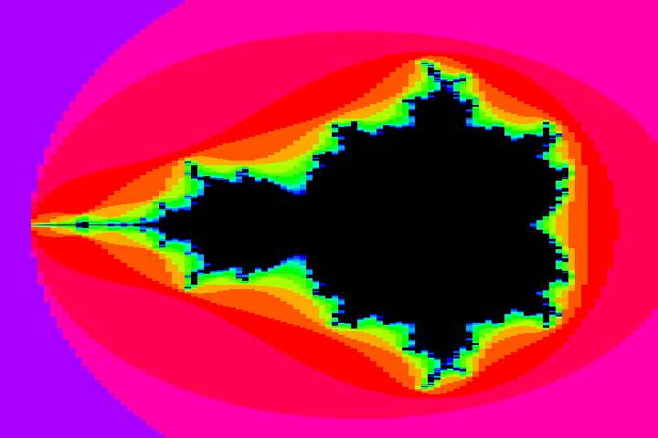

<!---

This file is used to generate your project datasheet. Please fill in the information below and delete any unused
sections.

You can also include images in this folder and reference them in the markdown. Each image must be less than
512 kb in size, and the combined size of all images must be less than 1 MB.
-->

## How it works

The Mandelbrot fractal is computed "racing the beam" and displayed through the [TinyVGA Pmod](https://github.com/mole99/tiny-vga).

One iteration of the computation is done over two clock cycles, and a maximum iteration depth of 14 iterations is used.  The design is clocked at 100MHz, allowing four clock cycles per 25MHz pixel clock.  This means one value is computed every 7 pixels, giving a result like this:

The computation uses 16-bit fixed point arithmetic.  The multiplications are approximated to save area, giving a possible error in the least significant bit.  This gives at least 14-bit accuracy on each iteration.

The output image is at a 720x480 resolution (~103x480 Mandelbrot pixels).

## How to test

Provide a 100MHz clock.

The image position and zoom can be configured using the input and bidir pins.

in[2:0] control the configuration to set, and {io[7:0], in[7:3]} specify a signed value when setting a register.

These values should only be updated during vsync.

| Ctrl | Value |
| ---- | ----- |
| 0    | Enable demo mode (Zooms in and out repeatedly) |
| 1    | Set X coordinate for top-left of screen to value / 2^10 |
| 2    | Set Y coordinate for top-left of screen to value / 2^11 |
| 3    | No action |
| 4    | Set X increment per column to value[9:0] / 2^13 | 
| 5    | Set Y increment per column to value[9:0] / 2^13 |
| 6    | Set X increment per row to value[7:0] / 2^13 | 
| 7    | Set Y increment per row to value[7:0] / 2^13 |

Note there are 103 columns and 480 rows displayed.

## External hardware

[Tiny VGA Pmod](https://github.com/mole99/tiny-vga) in the output socket.
