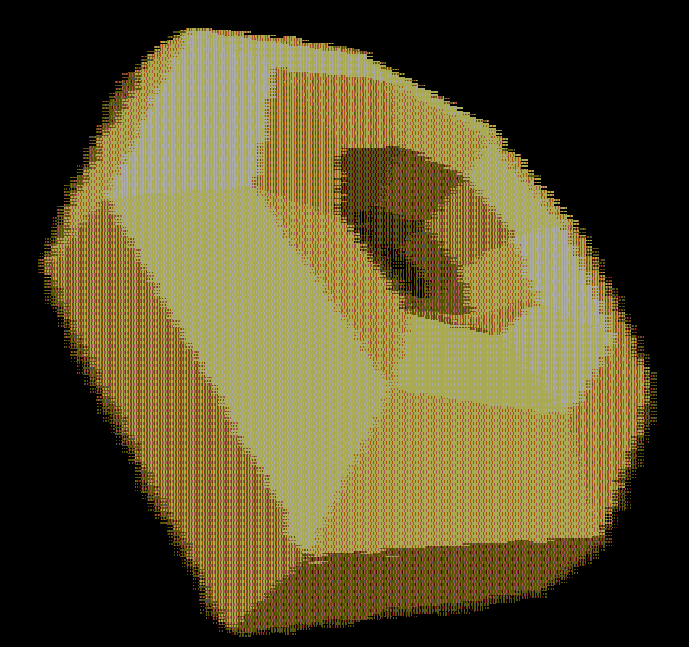

<!---

This file is used to generate your project datasheet. Please fill in the information below and delete any unused
sections.

You can also include images in this folder and reference them in the markdown. Each image must be less than
512 kb in size, and the combined size of all images must be less than 1 MB.
-->

# VGA Donut

## How it works

Renders a faceted donut to a VGA monitor.

Like my other demo on tt08, this runs in a weird VGA resolution: 1220x480.

Interestingly, it is not actually rendering any polygons; this is sphere traced
(AKA raymarched), using a CORDIC unit to calculate the distance between a point
and the surface of the torus. But, because we don't have much time (we're
racing the VGA beam!), we do just two CORDIC iterations, which causes the donut
surface to actually become polyhedral. This trick was [accidentally discovered
by Bruno Levy](https://x.com/BrunoLevy01/status/1718674786954399798) while
playing with a C version of my original donut code and I had to try it out in
Verilog -- so here we are.

The reason it has such low horizontal resolution is because it's doing 16 ray
marching steps per "pixel", with four CORDIC iterations unrolled into one clock
cycle (two iterations for the major axis, and two for the minor axis).

In order to fit this into 2x2 TinyTapeout tiles, a lot of sacrifices were made;
for one, it doesn't have a multiplier so the ray steps are by approximate
orders of magnitude.

## How to test

Run clock at 48MHz, connect VGA and sound Pmods, and give it a reset pulse.

## External hardware

[TinyVGA Pmod](https://github.com/mole99/tiny-vga) for video on o[7:0].
