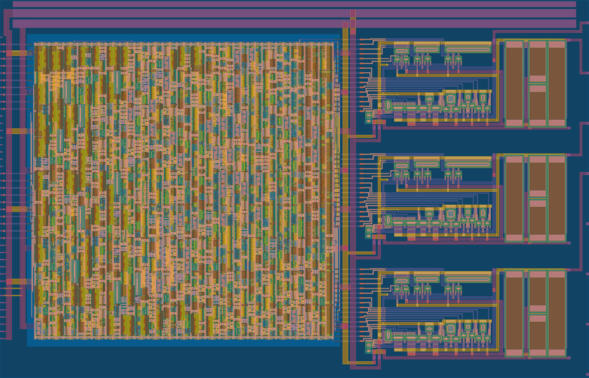

<!---

This file is used to generate your project datasheet. Please fill in the information below and delete any unused
sections.

You can also include images in this folder and reference them in the markdown. Each image must be less than
512 kb in size, and the combined size of all images must be less than 1 MB.
-->

## Overview

This project (tt08-vga-fun) uses (roughly-designed) current steering DACs to hopefully produce analog outputs that can produce an adequate RGB888 (24-bit) VGA image, based on patterns that can be generated from a simple digital controller. This improves on my previous [tt06-grab-bag](https://github.com/algofoogle/tt06-grab-bag) -- my 1st analog ASIC project, [included](https://tinytapeout.com/runs/tt06/tt_um_algofoogle_tt06_grab_bag) on [TT06](https://tinytapeout.com/runs/tt06/), using 3 RDAC instances instead.

With these current steering DACs, I'm hoping for an improved slew rate (estimated to be about 60-80nS; still below the target of 40nS, but better than the TT06 version which was estimated to be about 240nS).

Note that the analog R/G/B outputs (`ua[1:3]`) are expected to be in the range 0.9-1.8V, and high impedance, while VGA requires a 0.0-0.7V range and 75&ohm; impedance. Thus, external opamps will be required.

## How it works

There is a digital control block which can be [controlled by the state of the `ui_in` pins](https://github.com/algofoogle/journal/blob/master/0215-2024-08-21.md#explanation-of-digital-block-control-inputs) at reset. It has various test modes, and a pass-through mode.

Here are some of the test patterns it can produce, but note that the image probably won't be this clear because of: (a) poor matching; and (b) slew simulated to be worse than 40nS will lead to a little bit of horizontal smearing:

The digital control block internally drives 3 (RGB) colour channels, each of which has 8 positive and 8 negative polarity bits. This complementary polarity is required for switching the binary-weighted current steering transistors either one way or the other, maintaining an equal (estimated) current of 500&micro;A per channel. Each channel's internal current sum is then converted to a voltage with a pull-up resistor that is about 2.3k&ohm;.

Additionally the first analog output pin (`ua[0]`) is the internal `VbiasR` of the red channel DAC (gate voltage for current mirroring); this is for testing, but could possibly also be pulled up or down a little to see what effect it has on the red channel's output.

## How to test

TBC.

## External hardware

Probably an op-amp on each analog output, plus a VGA connector.

TBC.
