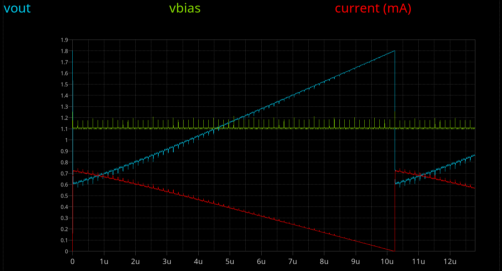

<!---

This file is used to generate your project datasheet. Please fill in the information below and delete any unused
sections.

You can also include images in this folder and reference them in the markdown. Each image must be less than
512 kb in size, and the combined size of all images must be less than 1 MB.
-->

## Overview

This is a mixed-signal design which is intended to drive an analog VGA display by producing analog colour signals (red, green, and blue) as well as digital HSYNC/VSYNC signals. It uses (roughly-designed) current steering DACs to hopefully produce analog outputs that can present an adequate RGB888 (24-bit) VGA image. A number of different test modes are available both for testing the performance of the design's DACs, as well as making simple pretty effects.

NOTE: Some external hardware will be required for actually buffering/biasing the analog signals to make them fully-compatible with a VGA monitor. See the "External hardware" section.

**The "How to test" section will help you get things running quickly**, but otherwise here are the features of this design:

*   There's a digital control block that offers different test modes and patterns. It operates from a 25MHz clock.
*   It latches your selected test mode on reset: set `ui_in` to the mode you want, and then reset the design.
*   It produces digital VGA outputs on `uo_out` pins, compatible with the Tiny VGA PMOD.
*   It implements three 8-bit DACs which produce analog outputs for each of the red, green, and blue channels.
*   The red and green channels (`ua[1]` and `ua[2]` respectively) produce output voltages estimated to be in the range 0.8-1.8V, using a current-steering design with internal pull-up resistors.
*   The red channel's "Vbias" voltage is exposed on `ua[0]`. This is set with a simple current mirror to be a nominal 1.373V, and could be pulled up or down a little externally.
*   The blue channel (`ua[3]`) uses a different segmented current-switching DAC design. It requires an external pull-up resistor of about 1.65k (to 1.8V) to produce an output voltage in the range 0.6-1.8V.
*   The blue channel's internal Vbias voltage can be set to one of 8 levels using a binary code on `uio_in[7:5]` (and can be varied, live).

The estimated typical current required by this design is on the order of 3mA: 500uA for each of the red and green channels (constant, due to their current *steering* nature), 750uA for the blue channel (varying, as it is just a current *switching* design), and some overhead for the digital control block.

NOTE: This design is flagged as using the 3.3V TT analog template, but it is only using the VDPWR (1.8V) and VGND lines -- a 3.3V strap is present, but unused.

This design improves on my previous [tt06-grab-bag](https://github.com/algofoogle/tt06-grab-bag) -- my 1st analog ASIC project, [included](https://tinytapeout.com/runs/tt06/tt_um_algofoogle_tt06_grab_bag) on [TT06](https://tinytapeout.com/runs/tt06/), using 3 RDAC instances instead. With these current steering DACs, I'm hoping for an improved slew rate (estimated to be about 60-80ns; still below the target of 40ns, but better than the TT06 version which was estimated to be about 240ns, and demonstrated to be able to get down to ~100ns in silicon).

## How it works

There is a digital control block which can be [controlled by the state of the `ui_in` pins](https://github.com/algofoogle/journal/blob/master/0215-2024-08-21.md#explanation-of-digital-block-control-inputs) at reset. It has various test modes -- some of which are sensitive to changes in `ui_in` *after* reset -- and also a pass-through mode (i.e. digital input code on `ui_in` passes directly through to all 3 DACs, live).

The figure below shows some of the test patterns it can produce, but note that the image probably won't be this clear because of: (a) poor matching; and (b) slew simulated to be worse than 40nS will lead to a little bit of horizontal smearing:

The digital control block internally drives 3 (RGB) colour channels. Two of these (R/G) each have 8 positive and 8 negative polarity bits. This complementary polarity is required for switching those two channels' binary-weighted current steering transistors either one way or the other, maintaining an equal (estimated) current of 500&micro;A per channel. Each channel's internal current sum is then converted to a voltage with an internal pull-up resistor that is about 2.34k&ohm;.

Additionally the first analog output pin (`ua[0]`) is the internal `VbiasR` of the red channel DAC (gate voltage for current mirroring); this is for testing, but could possibly also be pulled up or down a little to see what effect it has on the red channel's output.

**The blue channel has a different type of current-*switching* DAC** (i.e. not differential internally) and relies on an external pull-up resistor (recommended: 1.65k&ohm; up to 1.8V) to convert its current sinking range of 0~730uA to a voltage in the range 0.6V-1.8V. It is a "segmented" design where each pair of input bits goes through a simple 2-to-3 thermometer encoder to switch on up to 3 current sink transistors each, which are binary-weighted (1x, 4x, 16x, 64x) per set. **NOTE:** The Vbias voltage inside this DAC is set to one of 8 different levels using a binary code on `uio_in[7:5]`.

## How to test

1.  Connect the Tiny VGA PMOD to `uo_out`.
2.  Set `uio_in[7:5]` to `110` -- this sets the blue channel's Vbias to mid-range.
3.  Supply a 25MHz clock; this means each pixel is 40ns long.
4.  Set `ui_in` to `0001_0011`.
5.  Pulse RESET.
6.  With a VGA monitor attached to the Tiny VGA PMOD, expect to see basic grey levels, and a binary-coded "line number" along the right-hand edge.
7.  An oscilloscope on each of `ua[1]` (red) and `ua[2]` (green), set to trigger on HSYNC, should show both ramping from about 0.8V to 1.8V.
8.  Use about ~1.65k&ohm; to pull `ua[3]` (blue) up to 1.8V, and on a scope it should ramp from about 0.6V to 1.8V.

For information on connecting the analog outputs to a VGA monitor, see below ("**External hardware**").

Other things to try:

*   **If things are not working properly**, you could try setting `ui_in` to 0, pulsing RESET, and then feeding in whatever values you want on `ui_in` (without a reset) after that. This will take whatever binary code you present on `ui_in` and pass it through to all 3 DACs.
*   Set `ui_in` to `0010_0001`, pulse RESET, and expect to see the outputs inverting on every odd-numbered pixel; can be used to help test the slew rate.
*   Try varying `uio_in[7:5]` to change the current sink strength of the blue channel (by varying the internal Vbias for the blue DAC). Note that the bit order is reversed, and the codes are inverted, so given a 1.65k pull-up to 1.8V on `ua[3]`:
    *   `111`: Level 0, weakest Vbias (~0.3V); expect no output.
    *   `011`: Level 1, 0.86V; expected output range: 1.47-1.8V
    *   `101`: Level 2, 0.97V; range: 1.13-1.8V
    *   `001`: Level 3, 1.05V; range: 0.8-1.8V
    *   `110`: Level 4, 1.11V; range: 0.6-1.8V
    *   `010`: Level 5, 1.17V; range: 0.47-1.8V -- starting to become non-linear below 0.6V
    *   `100`: Level 6, 1.21V; range 0.4-1.8V
    *   `000`: Level 7, 1.26V; range 0.38-1.8V -- very non-linear
*   Try measuring the red channel's internal Vbias voltage on `ua[0]`, being aware that probing it will probably offset it a little. Try tugging on it (pulling it up or down by 10-100mV) to see what effect it has on the red channel's output level.
*   If you have the analog outputs reliably driving a VGA display (through suitable op-amps), try selecting different interesting patterns by setting different `ui_in` values (followed by a RESET pulse), e.g. `0101_1010` (or its static equivalent: `0110_0000`) or `0100_0000`.

## External hardware

Besides a 25MHz clock source and a VGA monitor, you can get away with a Tiny VGA PMOD connected to `uo_out`, but what you really want is something that can convert the analog outputs on `ua[3:1]` (i.e. `{B,G,R}` colour channel outputs) to the low-impedance (75&ohm;) 0-0.7V range required by a VGA monitor.

Note that whatever circuit you use for the red channel, exactly the same circuit will probably be what you use for the green channel too, since they use the same DAC design. The blue channel is the one that's different.

I'm yet to sketch out a suitable pair of op-amp circuits, but in any case you'll want:

*   one circuit that can take the 0.8-1.8V range of the R/G channels and convert them to a 0-0.7V range; and...
*   another circuit that *typically* converts 0.6-1.8V to the same 0-0.7V range, but which can also be adjusted, given the blue channel's Vbias can be varied using `uio_in[7:5]`.

Note that for my TT06 analog VGA DAC project I used the TI OPA3355.
