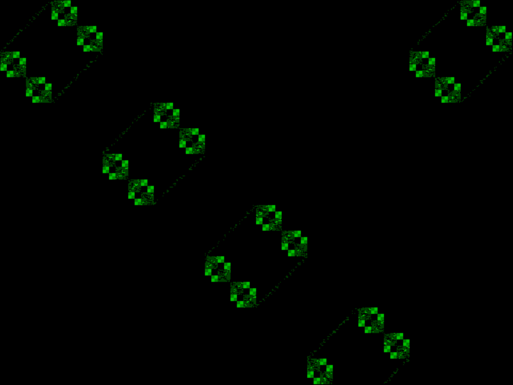

<!---

This file is used to generate your project datasheet. Please fill in the information below and delete any unused
sections.

You can also include images in this folder and reference them in the markdown. Each image must be less than
512 kb in size, and the combined size of all images must be less than 1 MB.
-->

## How it works

This generates VGA output for a munching squares animation plus some
other stuff, and some simple music. It uses the VGA and audio PMODs
listed below.

### Clock generation

A clock generator module divides the main clock `clk` and `vsync` into
two derived clocks - a 393kHz PWM clock for audio output, and a 10Hz
"audio tick" clock that drives the pattern sequencer. The clock
generator also provides counters for PWM, volume modulation, and audio
pattern sequencing.

### LFSR

An 11-bit LFSR provides a noise source. It is an XNOR type, shifting
down towards the LSB and inserting the new bit at MSB. XNOR taps are on
bits 0 and 2. Bits 0-5 of the LFSR register are used to provide a noise
channel and randomized video noise dithering.

### Video

The video output is the standard 640x480 @ 60Hz, using a 25.175MHz pixel
clock and negative polarity HSYNC/VSYNC. Timing is implemented with a
simple two-counter design shamelessly stolen from the Tiny Tapeout VGA
playground.

A fixed palette of eight colors is used, and eight brightness levels are
created by mixing random bits with the 2-bit per channel brightness
levels. Video is output on three layers - the background and layers 0
and 1. A non-black pixel overrides a pixel on any lower layer.

### Audio

Audio comes from a basic PSG inspired by the SN76489. There are four
channels of sound based on 12-bit timers - three pulse channels and one
noise channel. The only real difference between a pulse channel and a
noise channel is that the pulse channel flips state when the timer
counts down, and the noise channel takes a random state from the LFSR.
Each channel also has a two-bit volume level.

The 25.175MHz clock is divided by a 6-bit counter to create a 393KHz PWM
output. 6-bits gives 64 possible levels. The PWM high period is a simple
sum of the four channels' volumes at any given instant (multiplied by
two with the low bit dithered from the LFSR). This does mean the PWM
will glitch if volume levels change in the middle of a PWM cycle, but
that's fine in practice since it's all low-pass filtered anyway.

The four channels are programmed through a sequencer that provides note
and volume data to the PSG. The sequencer is clocked by dividing VSYNC
by 6, so the sequencer moves through pattern rows at 10Hz, or 600 ticks
per minute. Each pattern of 16 ticks represents one measure, four beats,
which means the music proceeds at 150 BPM.

The sequencer cycles through pre-programmed patterns of notes. Note
timer data is read from an indirected list of notes, then connected
directly to the PSG reload values. This does mean the oscillators are
not synchronized at note start. Volumes are modulated through a single
repeating pattern per channel, indexed from the top two bits of the
sequencer div-by-6 clock divider. This means the volume is a three-step
pattern cycling at the start of each pattern tick.

### Text Generator

On-screen text uses a segmented approach, where each segment is defined
by a mathematical description of a line segment. Each character is then
defined by which segments are off or on, like a multi-segment LED
display. So text is generated at full resolution despite its large size;
each character is 50x100 pixels.

The text generator is just a sequencer over an input bit stream, indexed
by the horizonal and vertical position. In this implementation the input
is at most six characters long. The text can be positioned arbitrarily,
but for this demo it is fixed.

### Stage Sequencer

A slower stage clock is derived from the pattern clock. It ticks once
every pattern cycle, and drives an overarching "stage sequencer". Each
stage counts down for a pre-programmed number of patterns, then switches
to the next. The stage number is used in various logic to change the
text and colors over time.

### Extra outputs

In addition to the audio and video, the three highest bits of the
internal pattern counter are output on `uio_out[6:4]`. The two highest
bits count out the four beats in a pattern, and bit 1 has a negative
edge at the beginning of each beat. This could be used for beat
synchronization with external systems - I just used it for debugging.

## How to test

Set the input clock for 25.175MHz. The Pico/RP2040 can output 25.177MHz on
GPOUT0 with a 125MHz main clock and a divider of 4 [integer part] and
247 [fractional part]. This worked on my TV.

Reset, and enjoy. :)

## External hardware

- [Leo's VGA PMOD](https://github.com/mole99/tiny-vga)
- [Tiny Tapeout Audio Pmod](https://github.com/MichaelBell/tt-audio-pmod)
