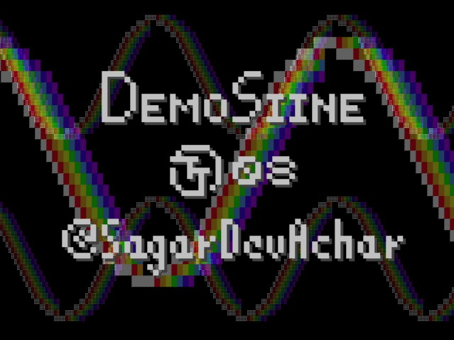

<!---

This file is used to generate your project datasheet. Please fill in the information below and delete any unused
sections.

You can also include images in this folder and reference them in the markdown. Each image must be less than
512 kb in size, and the combined size of all images must be less than 1 MB.
-->

<!-- Disable this once Input section comes in -->
## Preview



<!--  -->

## How it works

The project structure is as shown below
```
tt_um_demosiine_sda           : The main project :)
├── vga_controller            : Just a refactor of the standard hvsync_generator
├── graphics_engine           : Controls all the display output layers and animation
│   ├── overlay_creator       : Generates the overlay text and shadow
│   │   ├── text_demosiine    : Generates "DemoSiine" in big pixel letters
│   │   ├── text_tt08         : Generates "TT08" in big pixel letters
│   │   └── text_sda          : Generates "@SagarDevAchar" in big pixel letters (self shoutout!)
│   └── sine_layer            : Produces a pixelated VIBGYORW sine wave
└── audio_engine              : Produces the looping music note sequence
    └── freq_synth            : Generates variable frequency square waves
```

<!-- The `graphics_engine` (driven by the `vga_controller`, 640x480 @ 60Hz) is an on-demand RGB display pixel generator whose output can be altered using a few input pins. Previews of the different possible display outputs are provided in the last section of this documentation. -->

The `graphics_engine` (driven by the `vga_controller`) is an on-demand RGB pixel generator which produces a display output of resolution 640x480 @ 60Hz.

The `audio_engine` drives the `freq_synth` to produce a ~28 second looping sound track @ 140 BPM at the output.

## External hardware

- [TinyVGA Pmod](https://github.com/mole99/tiny-vga) connected to OUTPUT terminal (`uo_out`)
    - VGA Display connected to the HD15 female connector of the Pmod
- [TT Audio Pmod](https://github.com/MichaelBell/tt-audio-pmod) connected to BIDIR terminal (`uio_out`)
<!-- - Some switches to the INPUT terminal (`ui_in`) -->

## How to test

- Connect the necessary peripherals
- Provide a 25MHz clock to the top module `tt_um_demosiine_sda`
- Reset the design (if necessary)
- Enjoy the show :)
<!-- - Tweak the inputs to customize your show -->

<!-- ## Input Configurations -->
