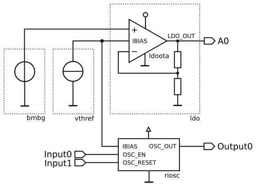
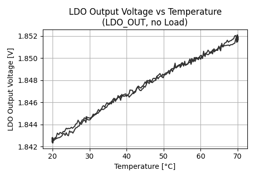
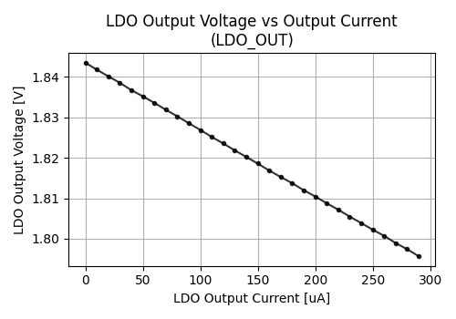
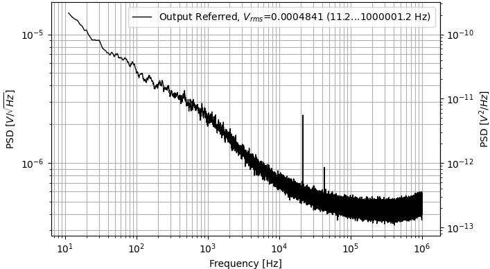
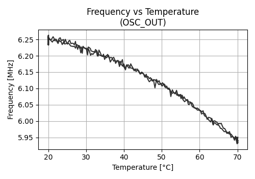
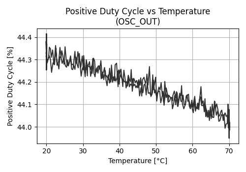

## Analog Building Blocks for Tiny Tapeout 8

- [Bandgap (bmbg)](https://devstdin.github.io/sky130artefacts_tt08/bmbg/bmbg/)
  - [OTA](https://devstdin.github.io/sky130artefacts_tt08/bmbg/bmbgota/)
- [Ref. Current Source (vthref)](https://devstdin.github.io/sky130artefacts_tt08/vthref_tt/vthref/)
- [LDO](https://devstdin.github.io/sky130artefacts_tt08/ldo/ldo/)
  - [OPAMP](https://devstdin.github.io/sky130artefacts_tt08/ldo/ldoota/)
- [Ring Oscillator (riosc)](https://devstdin.github.io/sky130artefacts_tt08/riosc/riosc/)

A trimmable version of the ring oscillator was taped out with the [IHP September shuttle](https://github.com/IHP-GmbH/TO_Sep2025/tree/main/Lumos).

## Measurement Results
### LDO
The plot below shows the measured temperature dependence of the unloaded LDO output. At 20 °C, the LDO output voltage is 1.842 V, which aligns very well with the Monte-Carlo simulations of the PEX-extracted design:: [LDO+BG+IREF PEX](https://devstdin.github.io/sky130artefacts_tt08/tt08/tt08/histplot_ldo_out_endgroup_('ff_mm',_-2),_('hh_mm',_-2),_('tt_mm',_-2),_('ll_mm',_-2),_('ss_mm',_-2)__228a6a77dd3a2fc332b30503c7af94b6.png).

Across the observed 50 °C temperature range, the measured LDO output increases by approximately 10 mV. a typical simulation of the [LDO’s temperature dependence](https://devstdin.github.io/sky130artefacts_tt08/ldo/ldo/#ldo-output-voltage-vs-temperaturebr) (excluding the bandgap) predicts an increase of only about 1.25 mV over the same temperature span. The same applies to the bandgap reference, which directly determines the LDO output voltage. Its [typical temperature sweep](https://devstdin.github.io/sky130artefacts_tt08/bmbg/bmbg/xyplot_temp-sweepv(vref)v(vdd)_('tt',_-2)__3516055f01315a7484bbe87ee259fa59.png) shows a variation of roughly 0.6 mV over 50 °C. In total, typical simulations therefore account for only about 2 mV of the measured 10 mV change.

Since typical simulations cannot explain the full temperature dependence, Monte-Carlo results for the [LDO](https://devstdin.github.io/sky130artefacts_tt08/ldo/ldo/histplot_vldo_tc20group_('ff_mm',_-2),_('hh_mm',_-2),_('tt_mm',_-2),_('ll_mm',_-2),_('ss_mm',_-2)__77a6f9ffbaae0c36f9d4f7a926eec6b5.png) and the [Bandgap](https://devstdin.github.io/sky130artefacts_tt08/bmbg/bmbg/histplot_vref_tc20group_('ff_mm',_-2),_('hh_mm',_-2),_('tt_mm',_-2),_('ll_mm',_-2),_('ss_mm',_-2)__6f8de2b3acb370cfea404af72ded0d3f.png) provide additional insight. The histograms indicate that, in rare cases, the bandgap’s temperature coefficient at 20 °C can reach 200 µV/°C, and the LDO’s can reach 50 µV/°C. If we really hit such a corner (which is very unlikely), the combined temperature drift would be approximately 12.5 mV over 50 °C, consistent with the measured behavior.

The TinyTapeout infrastructure was not included in all the simulations. Components such as the output multiplexers or the pad drivers could introduce additional temperature-dependent behavior. However, because the measurements were taken under no-load conditions, these structures are unlikely to contribute significantly to the observed deviation.

The following plot illustrates how the LDO output voltage changes with load current. At an output current of 300 µA, the output voltage drops by roughly 50 mV. This slope corresponds to an effective output impedance of about 160 Ω, which is well within the TinyTapeout specification of less than 500 Ω. For comparison, the LDO itself is expected to exhibit only about 1 mV of load-induced voltage drop under typical conditions, as shown in this [simulation](https://devstdin.github.io/sky130artefacts_tt08/ldo/ldo/#ldo-output-voltage-vs-load-currentbr). 

The plot below shows the PSD at the LDO output under no-load conditions. The measured output noise density at 10 Hz is 15 µV/√Hz, and the integrated noise from 10 Hz to 1 MHz becomes 484 µVrms. The spectrum is generally clean, with a single spur at 21.3 kHz and its harmonic at 42.6 kHz. The source of this spur is unknown; the evaluation board was powered from a battery, and there shouldn't be any switching regulators active during the measurement.

Two noise simulations were performed for the circuit:
- [LDO output-referred noise with an ideal (noiseless) reference source](https://devstdin.github.io/sky130artefacts_tt08/ldo/ldo/#ldo-voltage-noise-specification-pexbr): 1.8...1.9 µV/√Hz at 10 Hz
- [Output-referred noise of the bandgap reference](https://devstdin.github.io/sky130artefacts_tt08/bmbg/bmbg/#reference-voltage-noise-specification-pexbr): 13...19 µV/√Hz at 10 Hz

Both simulations use an ideal (noiseless) bias current source. The real bias source has a (simulated) [current noise](https://devstdin.github.io/sky130artefacts_tt08/vthref/vthref/#ac-noisebr) of approximately 10 pA/√Hz at 10 Hz. For this analysis, the bias current noise is assumed to be negligible.

The total expected output noise should be the quadratic sum of the LDO’s intrinsic noise and the bandgap’s noise multiplied by the LDO gain 
G = Vout/Vbg = 1.84/1.21 = 1.5:

Vn,total​ = √(Vn_ldo^2 ​+ (Vn_bg​*G)^2) ​≈ 20...29 μV/√Hz [at 10 Hz]

This 20...29 µV/√Hz span is slightly higher than the measured noise density of 15 µV/√Hz at 10 Hz.

### Ring Oscillator
Frequency and duty cycle were measured across a 50 °C temperature range. As shown in the two plots below, the oscillation frequency changes by approximately 6 kHz/°C, while the duty cycle remains nearly constant.

At 20 °C, the oscillator runs at 6.25 MHz with a positive duty cycle of 44.35%. Comparing these results with the [Monte-Carlo PEX simulations at 20 °C](https://devstdin.github.io/sky130artefacts_tt08/riosc/riosc/#transient-specification-monte-carlo-pexbr) shows that the simulated frequency range spans from 8.1 MHz to 10.8 MHz, significantly higher than the measured 6.25 MHz. A similar discrepancy appears in the duty cycle, which is expected to lie between 46% and 51% but is measured at 44.35%. The most likely explanation for the duty-cycle difference is that the digital output pad was not included in the Monte-Carlo simulations.

The frequency mismatch between simulation and measurement is more critical than the duty-cycle deviation. Because the design uses non-minimum-sized transistors, a closer match with simulation would be expected. It should be noted that the Monte-Carlo simulations were done with an ideal reference current source. Since the oscillator is a current-starved ring oscillator, its frequency directly depends on the reference current. Unfortunately, no simulations were performed to evaluate how frequency varies with reference-current deviations.

According to literature, the oscillation frequency is approximately proportional to the reference current. The [corner simulation](https://devstdin.github.io/sky130artefacts_tt08/vthref/vthref/xyplot_temp-sweepi(visource)group_('ff',_-2),_('hh',_-2),_('tt',_-2),_('ll',_-2),_('ss',_-2)__94b518e40830ed39bffc36cf7b5c0da9.png) of the reference-current source shows a current range of 9.2 µA to 9.9 µA, corresponding to a deviation of ±3.7% from the typical value. However, this ±3.7% variation in reference current is insufficient to account for the much larger frequency deviation observed at room temperature.

