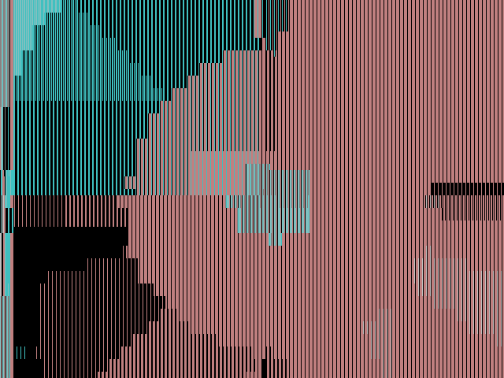
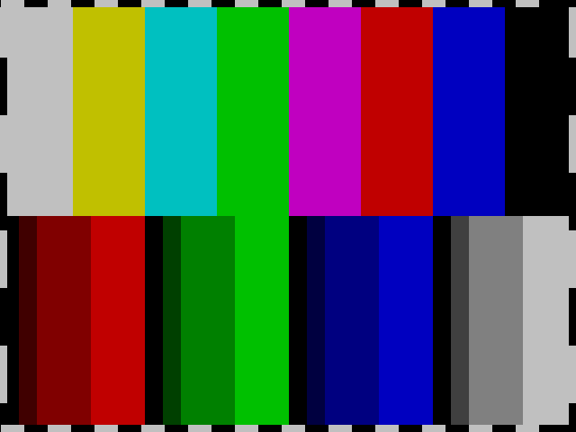

<!---

This file is used to generate your project datasheet. Please fill in the information below and delete any unused
sections.

You can also include images in this folder and reference them in the markdown. Each image must be less than
512 kb in size, and the combined size of all images must be less than 1 MB.
-->

## How it works

### Idea

This started out as an attempt to implement a ray tracer in 2 TT tiles.
However, there isn't enough room for a proper one, precision has to be limited,
which leads to unavoidable rounding errors.

So embrace rounding errors, and make them the primary feature!

The end result doesn't resemble a 3D scene, or a sphere, or in fact not even a properly rounded circle, but it has rounding errors! And that is the goal of this project now!

### HardCaml

The RTL was written using [HardCaml](https://github.com/janestreet/hardcaml), an OCaml DSL that emits Verilog.
For convenience the generated Verilog is committed into the source tree, so no additional tools are needed.

I used registers with asynchronous reset, in theory it should be better for an area constrained design.

### VGA signal generation

#### ModeLine

VGA signal timing is described in "3. DMT Video Timing Parameter Definitions" in "VESA Display Monitor Timing Standard Version 1.0, Rev. 13", and is implemented in `src/generator/modeline.ml`.
Examples on how to implement them on an FPGA are available in [several](https://digilent.com/reference/learn/programmable-logic/tutorials/vga-display-congroller/start) [places](https://zipcpu.com/blog/2018/11/29/llvga.html).

The code supports several resolutions, however to conserve area for the demo I've chosen only [640x480@59.94Hz](http://www.tinyvga.com/vga-timing/640x480@60Hz), which has negative `hsync`/`vsync` polarities.
This resolution would need a 25.175 MHz pixel clock, however that can't be produced exactly by the TT08 board, it can only approximate it using a PWM. Therefore, the design is configured to run at the nearest frequency that can be exactly generated: 25.25 MHz, which should be within the 0.5% acceptable by the standard.
The [ModeLine](https://en.wikipedia.org/wiki/XFree86_Modeline) implemented is:
`ModeLine "640x480_59.94" 25.175 640 656 752 800 480 490 492 525 -hsync -vsync`.
(This has 59.94 refresh rate and not 60Hz due to the standard preferring NTSC and its 1.001 adjustment).

The design itself runs off the VGA pixel clock, as I didn't want to deal with potential clock domain crossing issues.

#### Counters

There are 2 counters: one for H, and one for V synchronization pulses. When the H counter overflows it enables and increments the V counter for 1 cycle. This is implemented in `generator/vga.ml`, together with waveform expectation tests.

Both H and V counters start out in the visible area for convenience (we can directly use these counters as x/y coordinates, without needing to perform arithmetic in the circuit), then blank the colour signals for the duration of the front porch, synchronization signal and back porch.
Although the monitor would recognize the hsync+vsync low as the start of a frame, this is equivalent, but offset by a few clocks.

#### R, G, B colours

The demo supports 2-bit colours, and as usual these would be sRGB colours, not a linear scale.
So we define an internal table indexed by 3 bits representing a linear RGB value, mapping to the sRGB bits.

A register is used for the output, both to avoid logic glitches becoming visible to the monitor, and to provide a reg to reg path that `OpenSTA` can use to compute setup/hold times.

#### Generating the colours

When test mode is used (pin `ui[0]` set to `1`) the design outputs vertical colour bars with a white-black-white border. This doesn't have rounding errors, everything is sharp.

In normal mode (pin `ui[0]` is `0`) the "rounding error graphics" is rendered, see below.

### Ray marching

For an explanation of how ray marching works, see [this ray marching tutorial](https://jamie-wong.com/2016/07/15/ray-marching-signed-distance-functions/).
The "scene" is represented using [signed distance functions](https://iquilezles.org/articles/distfunctions/).
The "eye" Z coordinate is animated between 3.5 and 4.5 in 256 steps, where each frame is one step.

### CORDIC

Fixed point arithmetic with 9 bits of precision is used in the HDL, with the exponent tracked by the generator code to reduce register width (though this is not as good as tracking it in hardware, but that'd require more area).
Vector normalization is implemented using the [CORDIC](https://eclipse.umbc.edu/robucci/cmpeRSD/Lectures/Lecture20__CORDIC/) implementation provided by HardCaml, configured to use 10 bits, and a limited number of iterations (4) to fit into the desired area.
This works by rotating the vector until its angle is 0, and then rotating a second unit vector to match the rotation of the original. Or equivalently transform the original from rectangular to polar coordinates, overwrite the length with 1, and convert back from polar to rectangular.
CORDIC is defined for 2D in the library, and I define a 3D wrapper based on [rectangular to spheric coordinate conversions](https://www.ti.com/document-viewer/lit/html/SLYA069), although there would be ways to directly compute a 3D version of CORDIC, that is not implemented here.

This is implemented in `src/vecmath`.

### GLSL ES "emulation"

The low level operations are wrapped by a higher level embedded DSL that allows writing code quite similar to [GLSL ES](https://registry.khronos.org/OpenGL/specs/es/3.2/GLSL_ES_Specification_3.20.html#built-in-functions), with a very small number of operators: arithmetic (`+`, `-`, `*`, `/`), comparison (`==`, `<>`), `abs`, `min`, `max`, `clamp`, `length`, `distance`, `dot`, `normalize`, `reflect`.

Unfortunately the full renderer didn't fit into 2 tiles, so had to comment out quite a lot of the "GLSL" code (only 1 step of ray marching, no clamping, very simple gradient approximation), what is remaining does not resemble a sphere, or in fact it doesn't even look 3D.

### OpenLane configuration

The target density had to be increased to 98% to fit, and the setup slack margin setting had to be increased, see config.json.
There are max slew and max fanout violations at 100C and 1.6V, but that shouldn't prevent the design from working at 25C and 1.8V.

The design was simulated using both [tt-vgaviz](https://github.com/sylefeb/tt-vgaviz) and [vgasim](https://github.com/ZipCPU/vgasim), although had to adjust the modeline for vgasim to recognize the standard one.
A simple cocotb test which checked vsync/hsync generation was added post submission.

### Lack of audio

Audio is enabled, but is only a very simple test signal based on hsync and vsync.

### Simulating

There is a `src/sim/vgasim.ml`, which generates a `demo.v` compatible with [vgasim](https://github.com/ZipCPU/vgasim.git), this uses a different resolution though.
`vgasim` has to be called with `-g 640x480`, and `videomode.h` needs to be edited to use `480 490 492 525` (don't know why it wants `521`, that doesn't seem to be the standard timing).

Alternatively the `cocotb` test in `test/` can be run with `make -B WAVES=1`, and then [tt-vgaviz](https://github.com/sylefeb/tt-vgaviz.git) can be used: `tt-vgaviz tb.vcd` (actually in FST format).

## How to test

### Configuration
* Provide a 25.25 MHz clock on the `clk` pin (RP2040 should be able to provide this with no jitter).
Or if you can try 25.175 MHz instead, but this will have some jitter. YMMV.

* Power the design with at least 1.8V

### Main demo

* Set pin `ui[0]` to 0 to run the default demo.

* Reset the design

* You should see circles moving slowly and large rounding errors:

### Test mode

* Set pin `ui[0]` to 1 to show a test image with color bars.

* Reset the design again if desired

* You should see:

.

The "audio" out is connected, but is not expected to result in anything audible.

## External hardware

Connect according to the [Demoscene rules](https://tinytapeout.com/competitions/demoscene/#what-are-the-rules)

* VGA output using [Leo's VGA PMOD](https://github.com/mole99/tiny-vga) on pins `uo[0-7]`, connected to a monitor supporting 640x480 resolution.

* Audio output using [Mike's audio PMOD](https://github.com/MichaelBell/tt-audio-pmod) on `uio[7]`

