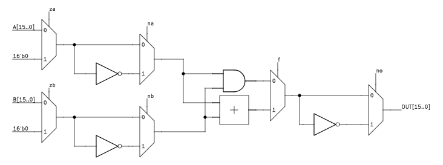
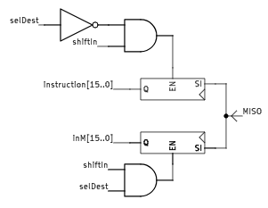
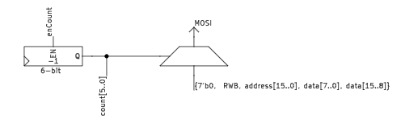
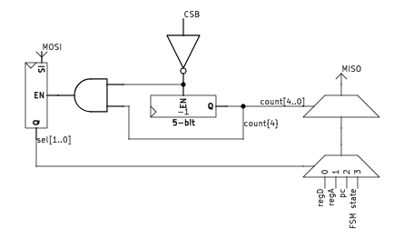

<!---

This file is used to generate your project datasheet. Please fill in the information below and delete any unused
sections.

You can also include images in this folder and reference them in the markdown. Each image must be less than
512 kb in size, and the combined size of all images must be less than 1 MB.
-->

## How it works

The device we developed is a 16-bit CPU based on the HACK architecture. The figure below shows the detailed architecture.

As we can see, it contains three main registers, an ALU, and two SPI modules. Each register has a unique function.

- D register stands as an accumulator.
- A register plays two roles. It first serves as an address register and also as a direct access register.
- PC is the program counter.

The ALU takes two different operands and is driven by 6 control signals, resulting in 18 different operations possible. Control signals can turn an operand to zero, logically reverse it, etc. The figure below shows how it is built.

Since we don't have enough space on the chip, we can't include the memory. Moreover, we cannot fetch the 16-bit long instruction and data memory values at the same time because we only have 24 I/O pins. This is why we had to think of another approach. The idea we came up with is to fetch or save a 16-bit word once at a time and use a serial protocol for the transfer. We can see below the state diagram of the CPU.

For the serial communication protocol, we chose SPI since it is one of the simplest to implement. We have to take into account 4 signals:

- MOSI: The signal containing the data transferred from the CPU to the memory.
- MISO: The signal transferring the data from the memory to the CPU.
- CSB: The signal that tells the memory that the CPU needs it.
- SCLK: The clock signal that cadences the transfer.

As shown in the figure below, SPI comes in 4 different modes. We are only going to work with modes 0 and 3 (Flip at the negative edge of the clock then sample on the positive edge).

The two following figures contain the logic circuits handling the transfer signals. As we can see, the MISO signal is latched in two different shift registers: one for the instruction, the other for the memory data. The MOSI signal is generated via a 40 to 1 multiplexer driven by a counter. The SPI module is monitored by its own FSM.

 

The final module also processes SPI signals but is used for debugging purposes. This time the SCLK and CSB are driven by the debugging device and the MISO and MOSI signals are inverted. The figure below shows how the module is built.

To communicate, the debugging device sends two bits of data, and depending on these bits, the CPU will output a specific value:

- 0: register D
- 1: register A
- 2: Program Counter
- 3: FSM state

## How to test

The chip needs to be connected to an SPI RAM. We focused the design around the 23XX512, an SPI RAM developed by Microchip Inc. Just add the binary code to the RAM and provide an adequate 12.5 MHz clock signal. For debugging, a microcontroller with an SPI interface can do the job.

Since the chip is going to be soldered to a debug board with an RP2040 on it, we can use the code provided by [MichaelBell](https://github.com/MichaelBell) to emulate the RAM ([Github repsitory](https://github.com/MichaelBell/spi-ram-emu.git)). The RP2040 can also be used as a debugger.

## External hardware

- 65 KB SPI RAM.
- Microcontroller with SPI interface.