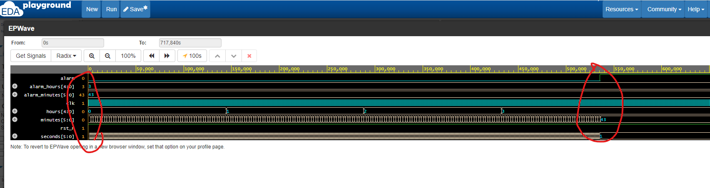

<!---

This file is used to generate your project datasheet. Please fill in the information below and delete any unused
sections.

You can also include images in this folder and reference them in the markdown. Each image must be less than
512 kb in size, and the combined size of all images must be less than 1 MB.
-->

## How it works

This project was sponsored by The MITRE Corporation and  MIT/LL Beaverworks Summer Institute https://beaverworks.ll.mit.edu/CMS/bw/bwsi . This is a simple alarm clock. There are two inputs alarm_hours and alarm_minutes. These two inputs are to be set to values less than 23 and 59 respectively. The output pin "alarm" is expected to be asserted when the internal counters hours and minutes hit the expected alarm_hours and alarm_minutes respectively. Alarm output will be stuck at 1 until reset. Time at which Alarm is triggered are also sent out as output for comparison. Due to limited number of Inputs and outputs available, some of the inout pins are used as well. output enable pins are used to mask the inputs and outputs appropriately. 

## How to test



Use below testbench to input specific values to inputs and observe alarm asserted and output hours and minutes match with inputs. 

```verilog
module tb();

  reg clk, rst_n;
  reg [5:0] alarm_minutes;
  reg [4:0] alarm_hours;
  
  tt_um_kapilan_alarm dut(
    .ui_in({alarm_minutes[2:0],alarm_hours[4:0]}),
    .uo_out(),
    .uio_in({5'b0,alarm_minutes[5:3]}),
    .uio_out(),
    .uio_oe(),
    .ena(1'b1),
    .clk(clk),
    .rst_n(rst_n)
  );
  
  initial begin
    rst_n = 1'b0;
    #100;
    rst_n = 1'b1;
    alarm_hours = 5'd3;
    alarm_minutes = 6'd43;
  end
  initial begin
    clk = 1'b0;
    forever begin
      #20;
      clk = ~clk;
    end
  end
  initial begin
    $dumpfile("alarm_dump.vcd");
    $dumpvars(0,tb);
    #1000000;
    $finish;
  end
  
  
endmodule
```