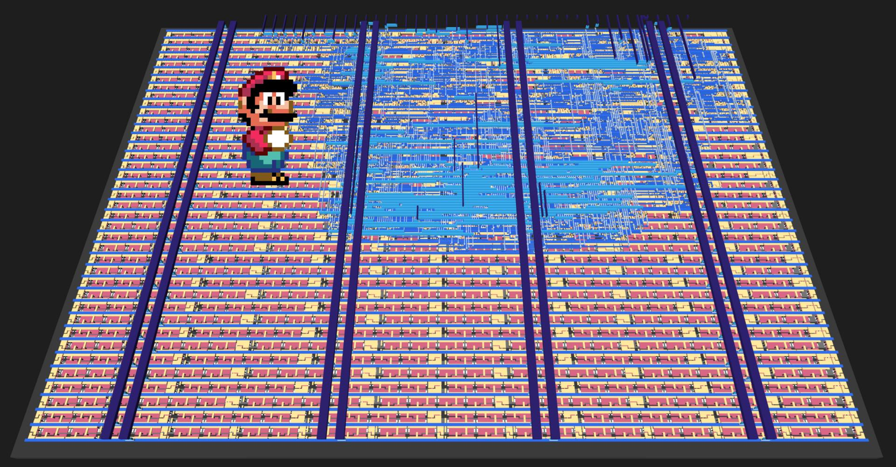
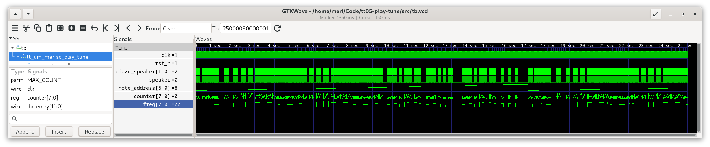
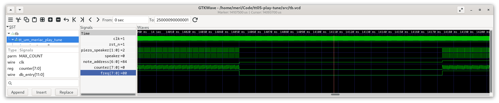

<!---

This file is used to generate your project datasheet. Please fill in the information below and delete any unused
sections.

You can also include images in this folder and reference them in the markdown. Each image must be less than
512 kb in size, and the combined size of all images must be less than 1 MB.
-->

## How it works

This design will play Super Mario Tune
over a Piezo Speaker connected across bidir[0:1] and bidir[7]. The speaker is driven
in differential PWM mode to increase its output power. The changed pinout
accomodates for the [Tiny Tapeout Audio Pmod](https://github.com/MichaelBell/tt-audio-pmod?tab=readme-ov-file#tiny-tapeout-audio-pmod).

(see also the [interactive version of this design](https://meriac.github.io/tt08-play-tune/))

Additionally - for testing purposes, the inputs ui[7:0] are copied to the hex segment display 1:1 (uo[7:0]).

## Verilog Design Files ##
- [Playback Logic](https://github.com/meriac/tt08-play-tune/blob/main/src/player.v#L38)
- Autogenerated [Super Mario Tune Storage](https://github.com/meriac/tt08-play-tune/blob/main/src/tune.v#L42-L45). This
  project contains a [Python-based script for converting a RTTL ringtone into optimized Verilog](https://github.com/meriac/tt08-play-tune/blob/main/generator/generate.py#L38).
  An additional [script converts TIM-file waveforms from the Verilog simulator back to a WAV-sound file](https://github.com/meriac/tt08-play-tune/blob/main/test/tim2wav-test.py#L38)
  to verify the correctness of the hardware-based player's sound.

### PWM Waveform in Verilog Simulation Output ###
Using [GTKWave](https://gtkwave.sourceforge.net/) for visualization of Simulation Results:

## How to test

Provide 100kHz clock on clk, briefly lower reset (rst_n)
and bidir[1:0]/bidir[7] will play a differential sound wave over piezo speaker
(Super Mario Tune).

## External hardware

Piezo speaker connected across bidir[1:0] (loud) or between bidir[7] and GND (less loud).
Alternatively you can connect the [Tiny Tapeout Audio Pmod](https://github.com/MichaelBell/tt-audio-pmod) to the bidir port to listen to the music.
