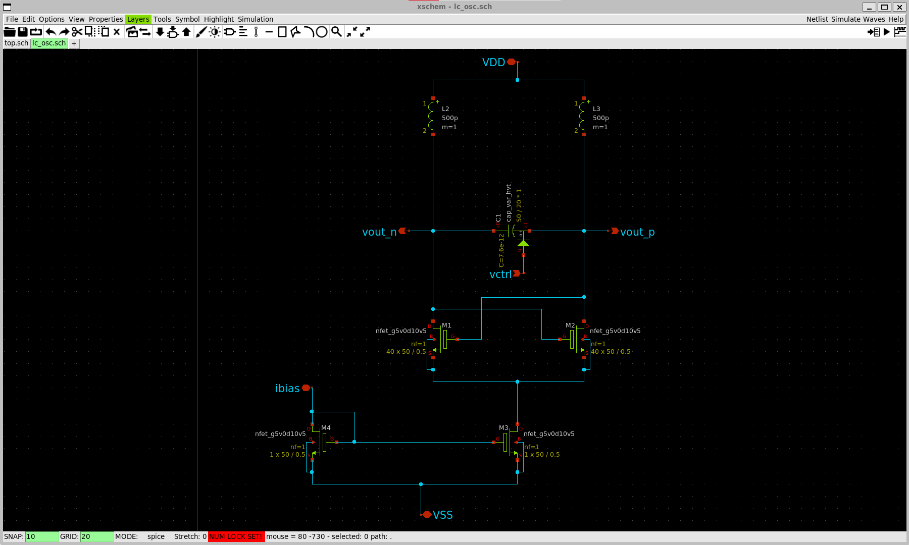
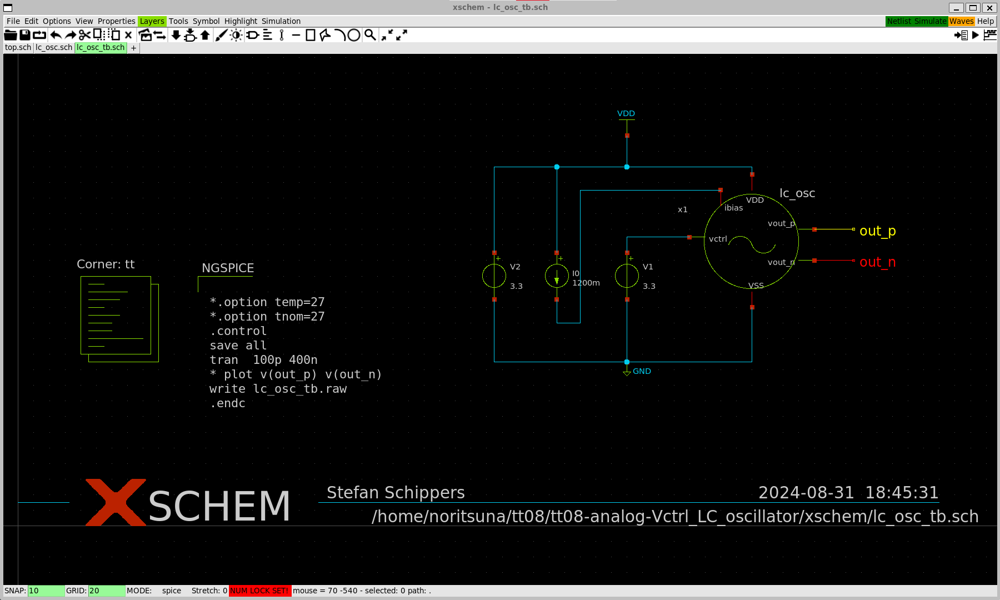
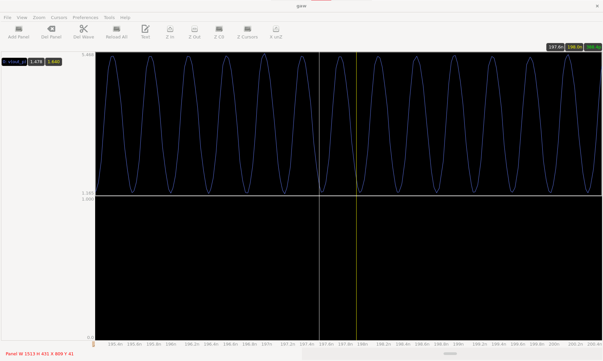
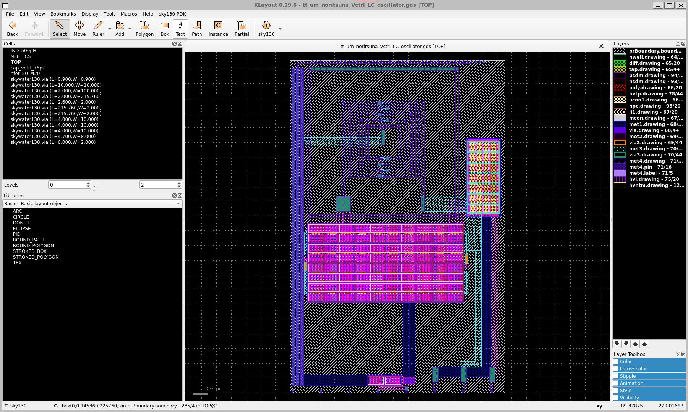

# Voltage Controlled LC-Oscillator
This project is "Voltage Controlled LC-Oscillator of 2GHz for Skywater130nm".

## Circuit

## Test Bench

### Result
- 388pSec = 2.6GHz 

## Layout

## Tapeout
This project made by [Tiny Tapeout](https://tinytapeout.com/).
