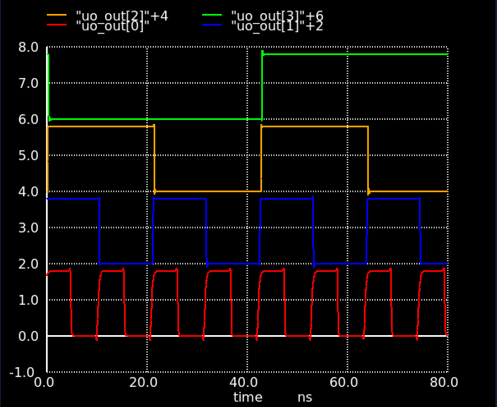

<!---

This file is used to generate your project datasheet. Please fill in the information below and delete any unused
sections.

You can also include images in this folder and reference them in the markdown. Each image must be less than
512 kb in size, and the combined size of all images must be less than 1 MB.
-->

## How it works

A simple yet stylish ring oscillator that uses a chain of 21 SkullFET inverters to generate a square wave output. Based on simulation, the oscillator should have a frequency of around 90 MHz.

## How to test

Connect an oscilloscope to the `osc_out` (ou_out pin 0) pin and enjoy the show. You can also observe the divided frequency outputs on `osc_div_2`, `osc_div_4`, and `osc_div_8`.

## Simulation results

The following graph shows the output of the oscillator and the divided outputs. It was generated by running `make -C sim` and patiently waiting for the simulation to finish:

The outputs are shifted by 2 volts to make them easier to see in the graph. "uo_out[0]" is the main output of the oscillator, and "uo_out[1]", "uo_out[2]", and "uo_out[3]" are the divided outputs.

Note that the simulation results do not include all the parasitics, only the main ones. The actual frequency of the oscillator will probably be lower than the simulated one.
