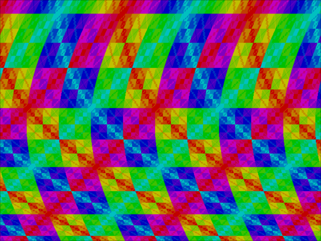
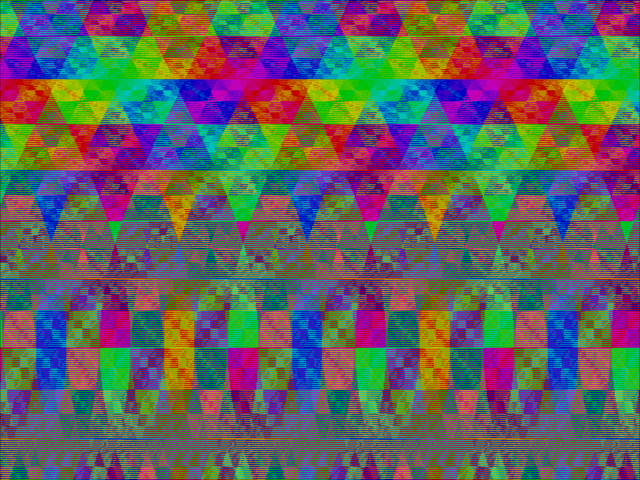

<!---

This file is used to generate your project datasheet. Please fill in the information below and delete any unused
sections.

You can also include images in this folder and reference them in the markdown. Each image must be less than
512 kb in size, and the combined size of all images must be less than 1 MB.
-->

## How it works

This design outputs a waggling 6-bit rainbow demo on VGA.

The demo will change effect based on inputs on `ui_in`.

| Pin | Setting | Effect |
| --- | ------- | ------ |
| `ui_in[0]` | Dual mode | Horizontally flips the image each scan line |
| `ui_in[1]` | H wave | Enables use of horizontal waves |
| `ui_in[4:2]` | P0 offset | Controls the speed of the H wave |
| `ui_in[7:5]` | P1 offset | Controls the speed of the V wave |

### Screenshots

 
Default

 
Dual Mode

 
H Wave

### Video

A video of a different (software rather than hardware) implementation, of the
waggling rainbow effect can be found at
<https://www.youtube.com/watch?v=AxT45_7WZUQ>.

## How to test

If wanting to test without hardware, use [the VGA
playground](https://tinytapeout.github.io/vga-playground/). Copy and paste the
contents of the entire `src/project.v` file into the playground's text editor,
replacing all previous content. Then, change the name of the module from
`tt_um_patater_demokit` to `tt_um_vga_example` and the simulator will start
running in your browser.

If testing with hardware, use a [TinyVGA
PMOD](https://github.com/mole99/tiny-vga). Clock the design with 25.175 MHz as
described in `info.yaml` (25.157 MHz is standard for 60 Hz 640x480 VGA video).

If testing with lower level simulation tools, an incomplete cocotb test bench
(`test/test.py`) is provided. Passing the tests in the cocotb bench is no
guarantee that the design will work.

## External hardware

External hardware required:
 - [TinyVGA PMOD](https://github.com/mole99/tiny-vga)
