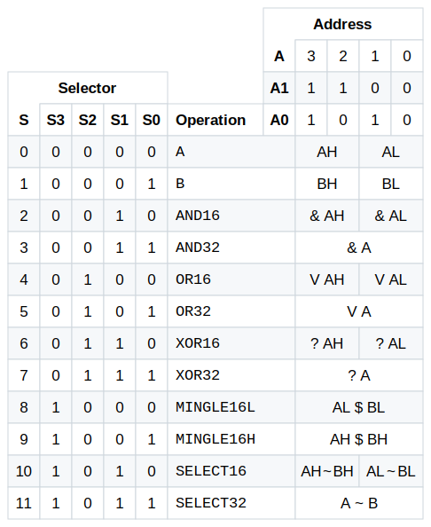

## How it works

As an educational project, it is inevitable that Tiny Tapeout would attract various pedagogical examples of common logic circuits, such as ALUs. While ALUs for common operations such as addition, subtraction, and binary bitwise logic are surprisingly common, it is much rarer to encounter one that can calculate the five operations of the INTERCAL programming language. Due to either the cost-prohibitive nature of Warmenhovian logic gates or general lack of interest, such a feat has never been performed until now. With chip production finally within reach of the average person, all it takes is one person who has more dollars than sense to design the fabled INTERCAL ALU (Arrhythmic Logic Unit).

The pin assignments for this design are roughly as follows. The /OE (output enable) and /WE (write enable) signals are active low, so should be set HIGH by default.

| # | Dedicated Input     | Dedicated Output | Bidirectional I/O          |
| - | ------------------- | ---------------- | -------------------------- |
| 0 | A0 (address)        | D0 (output only) | D0 (input and output only) |
| 1 | A1 (address)        | D1 (output only) | D1 (input and output only) |
| 2 | S0 (selector)       | D2 (output only) | D2 (input and output only) |
| 3 | S1 (selector)       | D3 (output only) | D3 (input and output only) |
| 4 | S2 (selector)       | D4 (output only) | D4 (input and output only) |
| 5 | S3 (selector)       | D5 (output only) | D5 (input and output only) |
| 6 | /OE (output enable) | D6 (output only) | D6 (input and output only) |
| 7 | /WE (write enable)  | D7 (output only) | D7 (input and output only) |

This ALU has two 32-bit registers, B and A (in no particular order). (These may also be thought of as four 16-bit registers, AL, AH, BL, and BH.) To write a byte to a register, set A0 and A1 to the byte address, set S0 LOW for the A register or HIGH for the B register, set S1 through S3 LOW, set the bidirectional I/O pins to the byte value, set /WE LOW, then set /WE HIGH again. (Do not set S1 through S3 HIGH when writing, or else something unpredictable will happen, most likely nothing.)

To read a register or result, set A0 and A1 to the byte address, set S0 through S3 to the desired operation, set /OE LOW, read the byte value from the bidirectional I/O pins, then set /OE HIGH. Results can also be read from the dedicated outputs; the dedicated outputs are not affected by the /OE signal, as they do not need to care about your feelings.

The operations supported are listed below. An attempt was made to make it understandable.

Operations 0 and 1 simply return the current value of the A or B register, respectively. This corresponds with the values of S0 through S3 used in write mode. This is not unintentional. This might also explain why S1 through S3 must be LOW in write mode.

Operations 2 through 7 correspond to INTERCAL's unary AND, unary OR, and unary XOR operators, represented by ampersand (&), book (V), and what (?), respectively. From the INTERCAL manual:

<blockquote>
These operators perform their respective logical operations on all pairs of adjacent bits, the result from the first and last bits going into the first bit of the result. The effect is that of rotating the operand one place to the right and ANDing, ORing, or XORing with its initial value. Thus, <code>#&77</code> (binary = 1001101) is binary 0000000000000100 = 4, <code>#V77</code> is binary 1000000001101111 = 32879, and <code>#?77</code> is binary 1000000001101011 = 32875.
</blockquote>

Operations 2, 4, and 6 work on the 16-bit halves of the A register independently, while operations 3, 5, and 7 work on the 32-bit whole of the A register.

Operations 8 and 9 correspond to INTERCAL's *interleave* (also called *mingle*) operator, represented by big money (&#36;). From the INTERCAL manual:

<blockquote>
The interleave operator takes two 16-bit values and produces a 32-bit result by alternating the bits of the operands. Thus, <code>#65535&#36;#0</code> has the 32-bit binary form 101010....10 or 2863311530 decimal, while <code>#0&#36;#65535</code> = 0101....01 binary = 1431655765 decimal, and <code>#255&#36;#255</code> is equivalent to <code>#65535</code>.
</blockquote>

Operation 8 returns the interleave of the lower halves of A and B, while operation 9 returns the interleave of the upper halves of A and B. (Should the chip fabrication process allow for it, operation 8½ will, of course, return the interleave of the middle halves of A and B.)

Operations 10 and 11 correspond to INTERCAL's *select* operator, represented by sqiggle (~). From the INTERCAL manual:

<blockquote>
The select operator takes from the first operand whichever bits correspond to 1's in the second operand, and packs these bits to the right in the result. Both operands are automatically padded on the left with zeros. […] For example, <code>#179~#201</code> (binary value 10110011~11001001) selects from the first argument the 8th, 7th, 4th, and 1st from last bits, namely, 1001, which = 9. But <code>#201~#179</code> selects from binary 11001001 the 8th, 6th, 5th, 2nd, and 1st from last bits, giving 10001 = 17. <code>#179~#179</code> has the value 31, while <code>#201~#201</code> has the value 15.
</blockquote>

To help understand the select operator, the INTERCAL manual also provides a helpful [circuitous diagram](https://www.muppetlabs.com/~breadbox/intercal-man/figure1.html).

Use of operations 12 and above is not recommended, unless undefined behavior is required.

## How to test

The following example calculations found in the INTERCAL manual should be particularly illuminating.

| S               | A     | B     | F          |
| --------------- | ----- | ----- | ---------- |
| `MINGLE16L` (8) | 0     | 256   | 65536      |
| `MINGLE16L` (8) | 65535 | 0     | 2863311530 |
| `MINGLE16L` (8) | 0     | 65535 | 1431655765 |
| `MINGLE16L` (8) | 255   | 255   | 65535      |
| `SELECT16` (10) | 51    | 21    | 5 *        |
| `SELECT16` (10) | 179   | 201   | 9          |
| `SELECT16` (10) | 201   | 179   | 17         |
| `SELECT16` (10) | 179   | 179   | 31         |
| `SELECT16` (10) | 201   | 201   | 15         |
| `AND16` (2)     | 77    |       | 4          |
| `OR16` (4)      | 77    |       | 32879      |
| `XOR16` (6)     | 77    |       | 32875      |

These test cases are included in the (unfortunately Python and not INTERCAL) `test.py` file. As these are likely more INTERCAL operations than any sensible person will ever perform, they should be sufficient for testing purposes. However, for curiosity's sake, an extensive set of additional test cases have also been included.

\* Not found in the INTERCAL manual.

## External hardware

The ALU may be used without external hardware, although seeing the output values may present a challenge. Instead, it is recommended to use a microcontroller of some sort to drive the inputs and read the outputs, as microcontrollers are designed to do. The implementation of the rest of the INTERCAL language is left as an exercise for the reader.

## Further reading

[The INTERCAL Programming Language Revised Reference Manual](https://www.muppetlabs.com/~breadbox/intercal-man/home.html) by Donald R. Woods and James M. Lyon with revisions by Louis Howell and Eric S. Raymond (can recommend highly enough)
