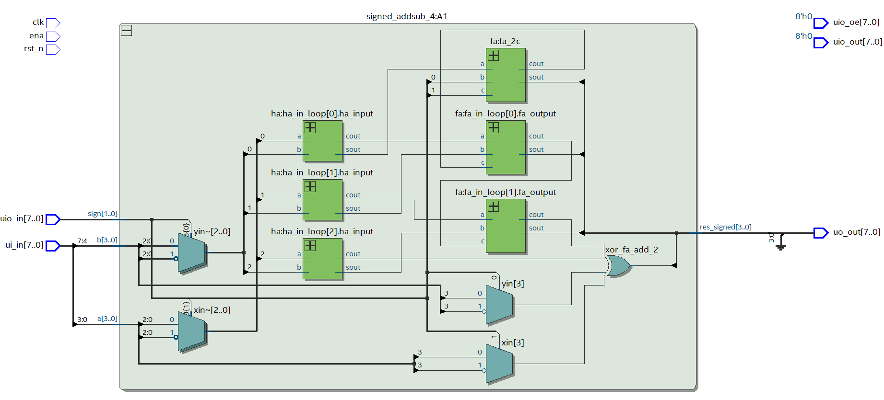

<!---

This file is used to generate your project datasheet. Please fill in the information below and delete any unused
sections.

You can also include images in this folder and reference them in the markdown. Each image must be less than
512 kb in size, and the combined size of all images must be less than 1 MB.
-->

## How it works

The project is a signed binary 4-bit adder-subtractor module. The module is constructed using muxes, half adders and full adders.

Depending on the sign[1:0] bits, the circuit can perform the following operations:

| sign[1:0] | Operation |
|:-----------:|:-----------:|
| 00 | A + B |
| 01 | -A + B |
| 10 | A - B |
| 11 | -A - B |

## How to test

The signed_addsub_tb testbench includes extensive test cases for the 4-bit Signed adder-subtractor circuit. The desing has been tested using QuestaSim.

## External hardware

None
