<!---

This file is used to generate your project datasheet. Please fill in the information below and delete any unused
sections.

You can also include images in this folder and reference them in the markdown. Each image must be less than
512 kb in size, and the combined size of all images must be less than 1 MB.
-->

# Warp

### Preface

This demo is running on hardware (ASIC, an actual chip!) in ~3400 gates. There's no cpu/gpu/ram, and it fits on 161x225 μm (130nm fab): [3D view of the chip](https://legacy-gltf.gds-viewer.tinytapeout.com/?model=https://sylefeb.github.io/tt08-compo-entry/tinytapeout.gds.gltf). Below is a simulation of the video and audio output showing the entire demo loop. This is all made possible thanks to [TinyTapeout](https://tinytapeout.com/).

> Please make sure to watch the demo for a few minutes as various effects play
> out before it loops. At start it waits for a few seconds to ensure VGA sync is
> achieved.

[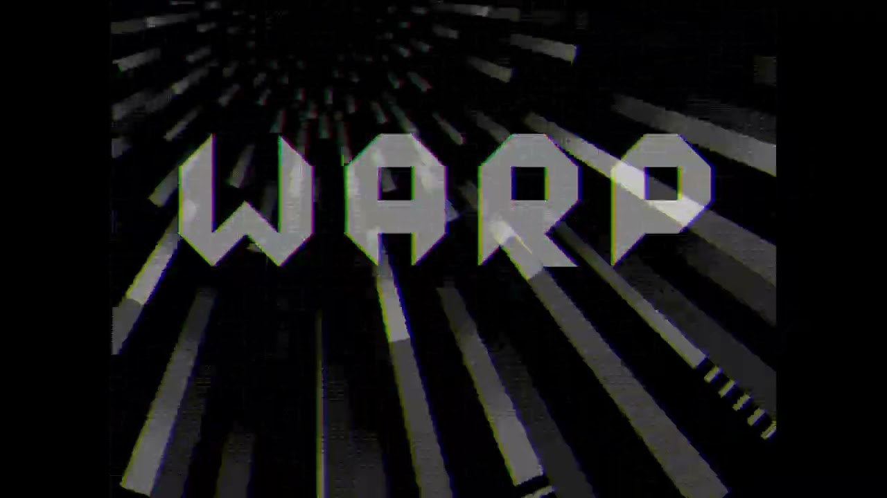](https://youtu.be/ELOYGwZgHnw)

This demo is written in [Silice](https://github.com/sylefeb/Silice/), my HDL.
Here is the [actual source](../src/silice/vga_demo.si). Silice now fully supports TinyTapeout as a build target.

> Warp is [2-tiles](https://app.tinytapeout.com/shuttles/tt08) design, I also have a [1-tile demo](https://github.com/sylefeb/tt08-fun/blob/main/docs/info.md) in tt08 ;)

## How it works

> *But does it work in ASIC?*

**[Update, January 2026]** Yes it does!!!!

### Why a tunnel effect?

The core effect is a classical [tunnel effect](https://lodev.org/cgtutor/tunnel.html) ; however this is normally done with a "huge" pre-computed table having
one entry per-pixel, and there is no way such a per-pixel table would fit in the design. So I thought it'd be challenging and fun to do it while
racing the beam! Plus, I really [like this effect](https://htmlpreview.github.io/?https://github.com/sylefeb/gfxcat/blob/main/runtime/gfxcat_tunnel.html).

> Note: *racing the beam* means producing the pixel colors as the video signal is being generated. The demo runs VGA at 640x480, with a pixel clock at 25MHz, so one RGB triple has to be produced every clock cycle in 40 nanoseconds. The video output is 2 bits per pixel, but internally the demo uses a higher pixel depth, then turned into 'shades' by [dithering](https://en.wikipedia.org/wiki/Ordered_dithering). To make the design smaller I made the tunnel internally gray-scale, and RGB effects are applied as a 'post-process' (details below).

### Graphics

#### The tunnel

As a rule of thumb, at 640x480 -- the resolution of the demo -- a pre-computed table would require at least 256KB (262144 bytes) of pre-computed data. We have roughly ~4000 logic cells, so ... well, it's not gonna fit :-)

There are several tricks at play: a shallow
[CORDIC](https://en.wikipedia.org/wiki/CORDIC) pipeline to compute an *atan* and *length*, and a few precomputed *1/x* distances to interpolate between -- these form keypoint rings along the tunnel. All the effects are then obtained by combining multiple layers in various ways (like a *tunnel effect processor* which registers can be configured for various effects).

Ok let's decompose this paragraph! Below you see the *atan* and *length* computed by the demo, followed by the *1/x* interpolation rings and the *1/length* image (internally available at a higher bit-depth, remapped for visualization).

    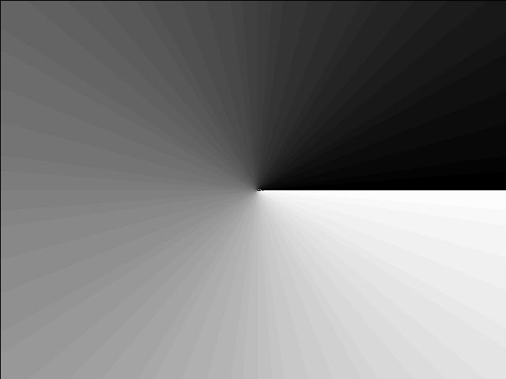
    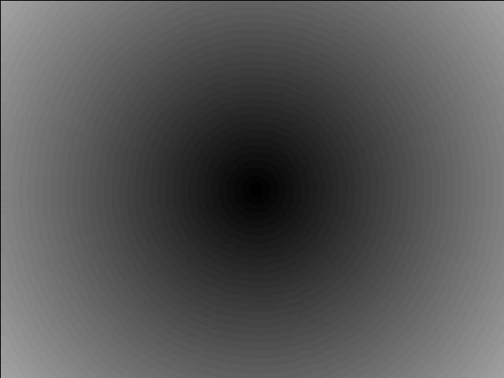 
    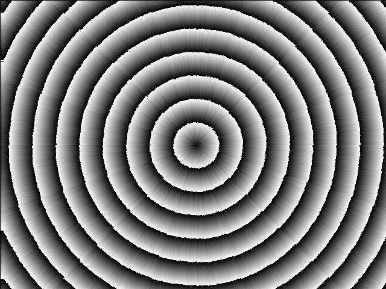
    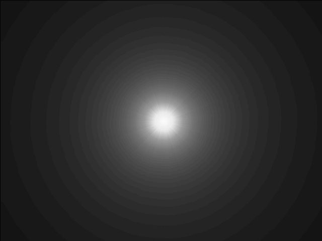

Normally computing all of these quantities would take ~20 iterations per pixel. So of course that's not possible, because we are targeting a 25 MHz clock matching the video signal generator and one pixel has to go out *every cycle*. We could maybe run the clock 2x or 4x, but certainly not 20x (0.5GHz). So what can we do? First, a precomputed division, and second -- most importantly -- a pipeline.

First, let's get rid of the division. The top right image shows the distance to the center -- *$length$* -- and the bottom right shows *$1/length$* -- distance from viewer -- which we want for the perspective effect. Now, instead of computing an actual general division we can use an old trick: we know the range of values if we cutout a small ring near the center, where $length$ goes to zero (and $1/length$ to infinity). That's fine, we'll just mask that out in 'the darkness of space'. We can then setup interpolation rings as shown bottom left. At the border of each ring the $length$ values are fixed and we pre-compute $1/length$ for each. In between the values are linearly interpolated. There's a tradeoff: fewer rings use less space but reveal distortion, many rings are accurate but use a ton of space. Guess what, I spent a lot of time playing with the number of rings :) (fortunately Silice pre-processor makes this kind of parameter exploration easy).

Second, the most important part, the pipeline! Even without division we are left with (at least) 6 iterations of CORDIC for a good effect. The idea is that at every clock, we compute all required 6 steps, but in parallel for different pixels, in a pipeline. At a cycle $i$ pixel at screen coordinate $x$ enters the pipeline and we compute iteration $0$ on it. But at the same time we have $x-1$ at iteration $1$, $x-2$ at iteration $2$, $x-3$ at iteration $3$, and so on. If the pipeline has six stages, the pixel at $x-6$ is fully computed when the pixel at $x$ enters. This implies that the pipeline has to start ahead of the video signal, so the first pixel is available in time (latency). The great thing is that at full peak the pipeline outputs one pixel every iteration, while applying all six iterations to *different* pixels at once. In ASIC we don't have to do super-deep pipelines because the signal propagates very fast (compared to e.g. an FPGA) so the actual pipeline of Warp is 'only' two stages of three CORDIC steps, and five stages in total, because of course a lot happens after CORDIC to make all the tunnel variants!

Pipelines in Silice are very easy to create with the `->` operator. Here is the code structure in terms of pipeline (stages code is replaced by `/* ... */`):

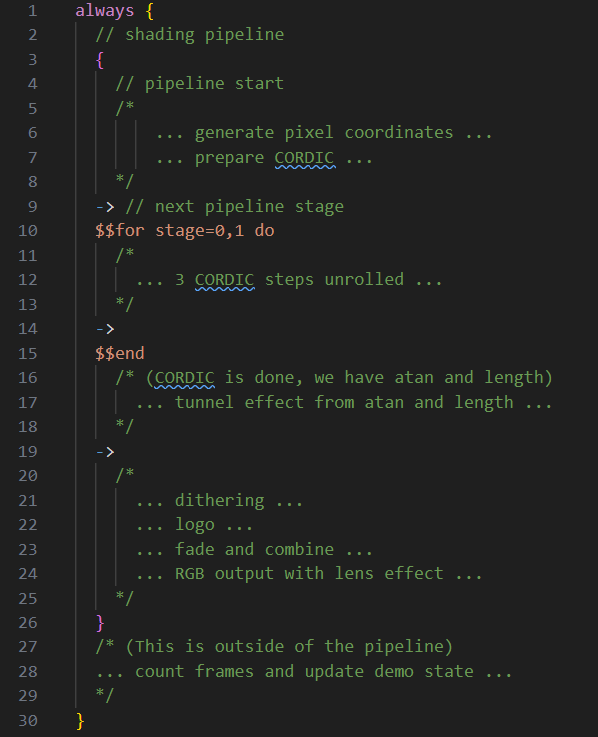

The lines starting with `$$` are pre-processor lines (L10, L15), here the `for` loop (L10) repeats the code L11-14, including the `->` operator, so it creates two pipeline stages. The pipeline is contained within the braces, it is fed by its first stage (L5-8) where pixel coordinates are generated, a different pixel at every clock cycle. The overall `always` block contains the logic performed at every cycle, for as long as the chip is powered.

Let's take a look at a single CORDIC step:

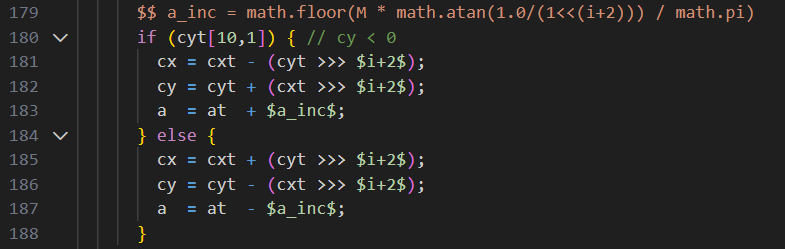

The interesting detail here is L179, where the pre-processor is used to compute
`a_inc`, which then becomes a constant when used with `$a_inc$` in the code (L183, L187). This increment is very important in computing the $atan$ value correctly,
and is different at every iteration. The CORDIC iteration is given by `i+2` in
the `a_inc` expression.

> `i` increments by 3 each pipeline stage, each stage unrolls 3 CORDIC steps, this is showing the last one, hence `i+2`.

### Register combiners

Controlling the various effects -- there are several tunnel variants -- is done through a set of registers. Changing these values produce variants of the tunnel and on-screen effects. This is reminiscent of the good-old-days of [GPU register combiners](https://registry.khronos.org/OpenGL/extensions/NV/NV_register_combiners.txt) controlling effects in early GPU pipelines.

The code for that is shown below:

    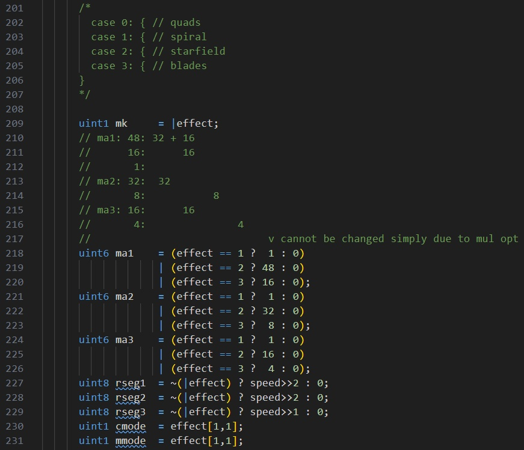

At the top there is a commented switch-case. That's how it started, and then it ended up squashed into an unreadable optimized logic below :) This sets up all the key registers that control the tunnel effect (`ma1`,`ma2`,`ma3`,`rseg1`,`rseg2`,`rseg3`,`cmode`,`mmode`). These are used in the logic afterwards. They control the texture, the viewpoint, the color shifts, etc. The master is `effect` and it is updated with the number of passing frames.

    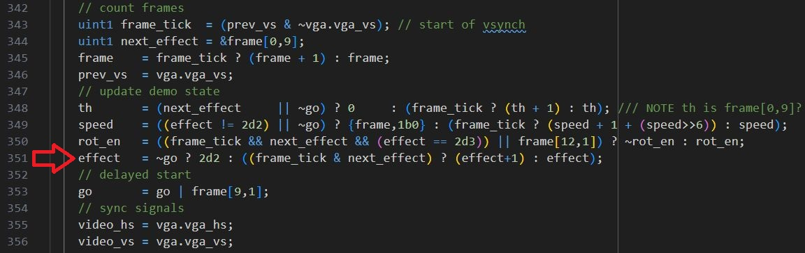

### Additional effects

The demo uses a lot of dithering (ordered Bayer dithering) given the output is RGB 2-2-2. All computations are internally grayscale 6-bits before dithering. The RGB lens effect is obtained by delaying the grayscale values using the tunnel view distance in R and B.

The tunnel viewpoint change is obtained simply by shifting the tunnel center. I was surprised that a simple translation gives such a convincing effect (almost as if the viewpoint was rotating).

The 'blue-orange' tunnel effect is obtained through temporal dithering, one frame being the standard tunnel, the other the rotated tunnel. This gets combined with the RGB lens distortion, achieving the final look.

#### The logo

Since the start I knew the demo would be called 'Warp', I got this 'mind picture' of an uncontrolled space warp unfolding after a computer crashed.

> The demo has a back-story, check out the [code source header](https://github.com/sylefeb/tt08-compo-entry/blob/170801e86eb10668c15830027dbd7b193c6d5677/src/silice/vga_demo.si#L10). Hey, it's no
> Hugo-prize winner but we've seen some games with less storytelling ;)

    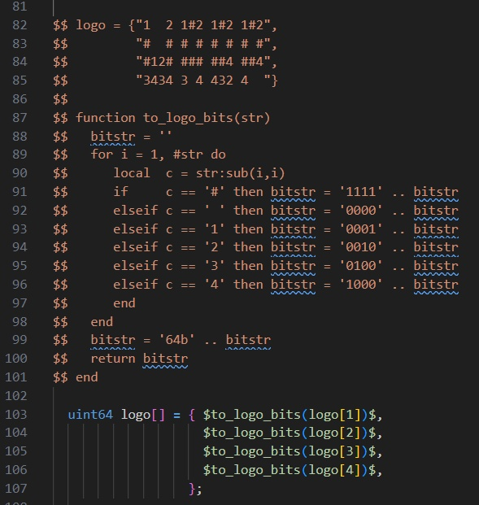

So of course I wanted a cool logo to go with it. I initially went for a pixelated
look but it felt crude, so I started to ponder about a cleaner outline. The
key idea was to do it from tiles: a square and triangles in various symmetries.
From their, a comparator and a bit of logic is used to do all four possible triangles.

Btw, I still have the drawing on my board two years later!! (it did suffer a bit).

    

Look carefully at the code above (lines 82-85) and the W on the board. Can you see it?

### Audio

I am no musician, so making a soundtrack was a challenge for me, but that's something I've always wanted to try. In the end it was a very enjoyable part of the design, and I was surprised
at how compact this can be made, the soundtrack using perhaps around 10% of the entire design.

I tried to make a track that matches the spirit and rhythm of the graphics. It is what is is, but I'm happy that there's sound at all!

In Silice code, this is what the *entire* music track and audio logic looks like ([source code](https://github.com/sylefeb/tt08-compo-entry/blob/1a64b6fefaaef9963322092fc917bb73be507f7d/src/silice/vga_demo.si#L370)):

    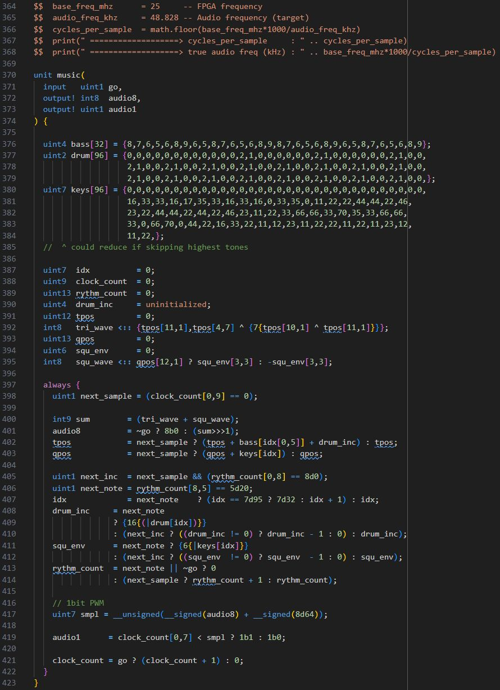

The arrays at the top here are the music track, the code that follows implements bass, drums and keys (or that was the plan, anyway ;) ). The sound itself is a sum (L400) of a triangular (L392) and square wave (L395).

> Triangular is softer than square, [try a sound generator](https://onlinetonegenerator.com/) to hear the difference.

The square wave generates the keys, it has an envelope that decreases down to zero (L411-412) starting at 63.

> `{6{|keys[idx]}}` produces `6b111111` as soon as any bit in `keys[idx]` is `1`, the `|x` operator returns a *or* between all bits of `x` (reduction).

The wave frequency is driven by the value in the `keys` table which is added to the wave position `qpos` (L403). The triangular wave which is responsible for the bassline, it has no envelope and its frequency is controlled by the `bass` table. Now there's a drum of sort, which is impacting the frequency of the bassline to accelerate it by adding `drum_inc` to it (L402). `drum_inc` starts at the value given in `drum` and decreases away (L408-L410). Looking at the `drum` table, you can see it is always doing `2,1` with different spacings of `0`. This produces the accelerating heartbeat effect in the sound track (1 produces low-pitched and 2 high-pitched drums) . And that's it! Again making no claims this is any good, but it does the job of accompanying the graphics, I think (hope :) ).

You might have noticed the audio unit outputs both `audio1` (the actual 1-bit audio signal for tt08!) and `audio8`. The 8-bit version is used on FPGA to test with an audio DAC, it is ignored otherwise. But how do we go from 8-bits to only one? The usual PWM (pulse-width-modulation) trick: audio is low frequency from a hardware point of view (even 44kHz is very slow compared to our 25MHz) so we can generate a high frequency 1-bit signal that will average itself when going through the audio hardware backend (the speaker itself is a huge dampener). This works like magic!

    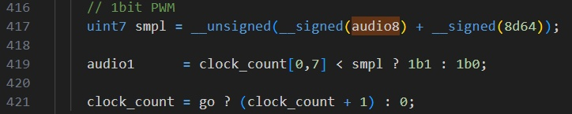

## ASIC

The design reached a very high density, **95.62%** utilization. This may be due to the pipelined nature of its core computations? In any case it's pretty cool as it means it uses almost every bit of available space!

The chip is shown below but also check out the [3D view](https://legacy-gltf.gds-viewer.tinytapeout.com/?model=https://sylefeb.github.io/tt08-compo-entry/tinytapeout.gds.gltf).

    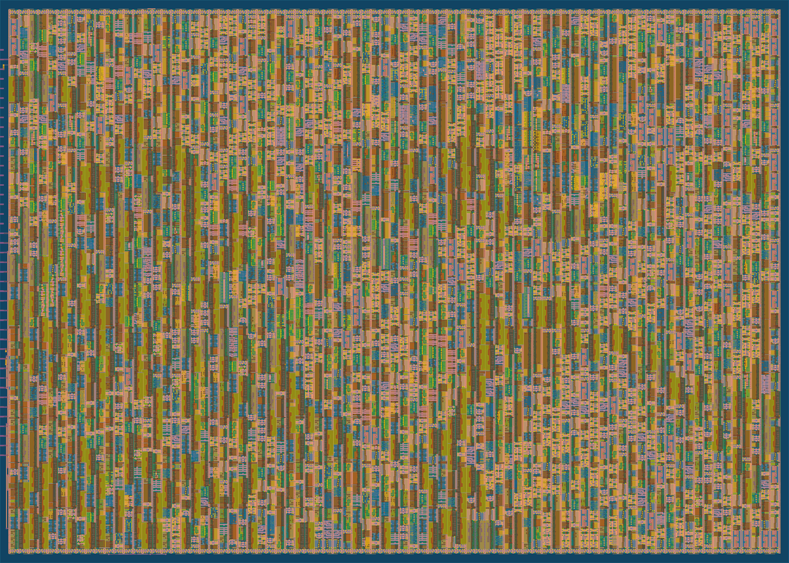

## Further reading

Thanks for reading so far! If you enjoy this type of hardware-oriented Graphics adventures here's some more links you will likely enjoy, starting by a video all the amazing other demo entries in tt08!:
- [bitluni live-stream recording showing all demos in tt08](https://www.youtube.com/watch?v=A9BhSaqL7jg).
- [a1k0n's detailed write up on his demos](https://www.a1k0n.net/2025/12/19/tiny-tapeout-demo.html) and [3d torus](https://www.a1k0n.net/2025/01/10/tiny-tapeout-donut.html) (also with CORDIC fun), all in tt08.
- [My tt07 terrain explorer](https://mastodon.online/@sylefeb/113924385249401994), also in [tt07 bring-up party](https://www.youtube.com/watch?v=NoGewMTtAjQ). (It's trully an incredible moment when your first ASIC turns up!).
- Of course the [TinyTapeout website](https://tinytapeout.com/)! A lot more designs to discover and enjoy.

## How to test

Plug the VGA+audio PMODs to the board and run. Maybe it works? **[Update, January 2026]** Yes it does!!!!

Simulation of both audio and video can run on an ECPIX5, with the Diligent VGA
PMOD on ports 0,1 and an I2S audio PMOD on port 2 (upper row).
The audio also runs on an ULX3S using its DAC (but no video in this case).

## External hardware

- [VGA PMOD](https://github.com/mole99/tiny-vga)
- [Audio PMOD](https://github.com/MichaelBell/tt-audio-pmod)

See https://tinytapeout.com/competitions/demoscene/
