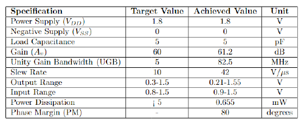
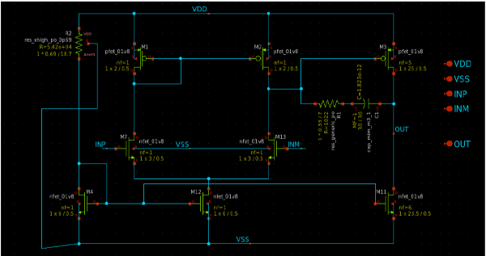

<!---

This file is used to generate your project datasheet. Please fill in the information below and delete any unused
sections.

You can also include images in this folder and reference them in the markdown. Each image must be less than
512 kb in size, and the combined size of all images must be less than 1 MB.
-->

## How it works
This project contains in total 3 circuits: 2 nos. of 2-stage opamp and 1 POR (Power on reset) circuit. These circuits are  designed by participants of analog IC design training conducted by SSP (Saudi Semiconductor Program). 

### 2-stage Opamp
A 2-stage Miller operational amplifier (op-amp) circuit comprises two amplification stages, with a Miller capacitor connected between the output of the first stage and the input of the second stage. This arrangement improves stability and bandwidth, making it ideal for high-gain, high-frequency applications. The 2-stage Miller op-amp is frequently utilized in precision analog signal processing, active filters, and high-impedance buffer circuits.

**First Stage:** An NMOS differential input pair, selected for its high transconductance and speed, amplifies the difference between the input signals.

**Second Stage:** A common-source amplifier further increases the gain.

Miller Compensation involves using a capacitor between the output of the first stage and the input of the second stage to stabilize the op-amp by introducing a dominant low-frequency pole, which ensures stability in feedback systems.

In the op-amp design submissions, **Amr Abdelrahman** and **Majid Sami** each presented their designs. The details of their submissions are as follows.

#### (1) Design by Amr Abdelrahman

#### (2) Design by Majid Sami

### POR (Power On Reset) Circuit
Power-on reset (POR) circuit ensures that electronic systems start up in a known, stable state by generating a reset signal when power is initially applied. This circuit detects when the power supply reaches a sufficient voltage level and holds the reset line active until the voltage stabilizes, preventing erratic behavior and data corruption. POR circuits are crucial in microcontrollers, consumer electronics, and industrial systems, as they guarantee reliable initialization and consistent performance, thereby enhancing system stability and functionality during power-up.The circuit designed without capacitor which yields 30% reduction of chip’s area compared to the conventional designs

#### (1) Design by Khalid Alorayir

## How to test
### (1) Testing Opamp Circuit
#### Non-Inverting Configuration
1. **Set Up the Circuit:** Connect the op-amp with the input signal to the non-inverting input (+) and a feedback resistor network to the inverting input (−).
2. **Power the Op-Amp:** Apply the required positive and negative supply voltages.
3. **Apply Input Signal:** Feed a known input signal to the non-inverting input.
4. **Measure Output:** Use an oscilloscope or multimeter to measure the output voltage and verify if **Vout = Vin.(1 + Rf/Rin)** matches the measured output.
5. **Check Frequency Response:** Ensure consistent gain across frequencies.
6. **Evaluate Stability and Linearity:** Look for any oscillations or instability and confirm the output accurately represents the input signal.

#### Buffer (Voltage Follower) Configuration
1. **Set Up the Circuit:** Connect the op-amp with output to the inverting input (−) and the input signal to the non-inverting input (+).
2. **Power the Op-Amp:** Apply the necessary supply voltages.
3. **Apply Input Signal:** Feed a known input signal to the non-inverting input.
4. **Measure Output:** Use an oscilloscope or multimeter to measure the output voltage and ensure it closely follows the input with minimal offset.
5. **Check Frequency Response and Stability:** Confirm fidelity of output across different frequencies and ensure stable output without oscillations.
6. **Assess Load Driving Capability:** Test with various loads to verify effective driving.

### (2) Testing POR Circuit
1. Power up the circuit such that VDD voltage reaches final 1.8V value from 0V in 1us to 10us seep time.
2. Check the reset signal with an oscilloscope to confirm proper activation and deactivation.
3. Verify that the voltage reaches the threshold and that the reset signal duration is sufficient, especially for rise times of 1µs to 10µs.
4. Test the POR circuit under varying power conditions and ensure correct system initialization post-reset.
5. Power down and repeat the test to ensure consistent performance.

## External hardware
Digilent Analog Discovery can be used for various measurements of opamp circuits. 

1. **Signal Generation**: Use the Analog Discovery's waveform generator to create test signals for the op-amp and power-on-reset circuits.
2. **Measurement**: Connect the oscilloscope probes to monitor the input and output signals of the op-amp and observe the behavior of the power-on-reset circuit.
3. **Frequency Response**: Analyze the frequency response of the op-amp by sweeping through various frequencies and recording the output using the Analog Discovery's built-in tools.
4. **Transient Analysis**: Measure how the op-amp and power-on-reset circuits respond to transient signals or sudden changes, such as power-up events.
5. **Voltage Levels**: Check the stability and correct operation of the power-on-reset circuit by measuring the voltage levels and timing of the reset pulse.
