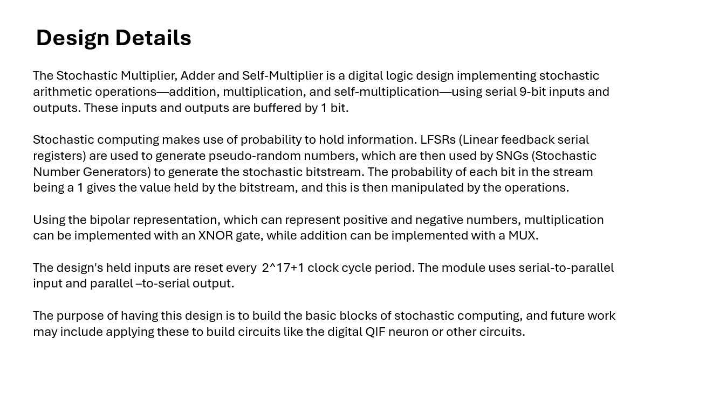
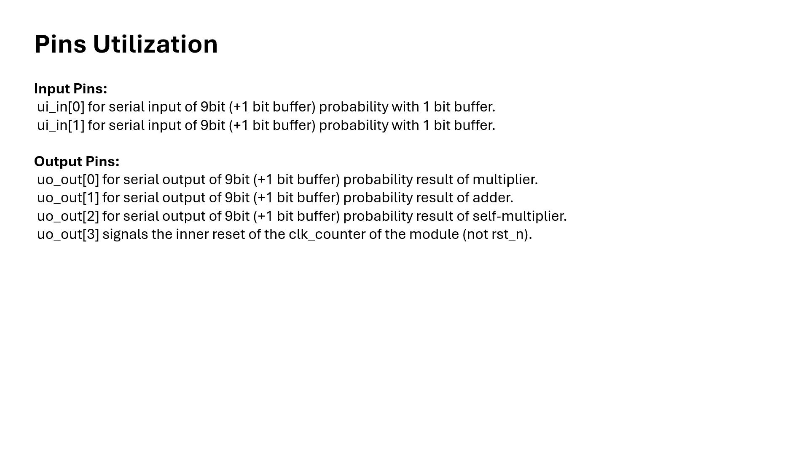
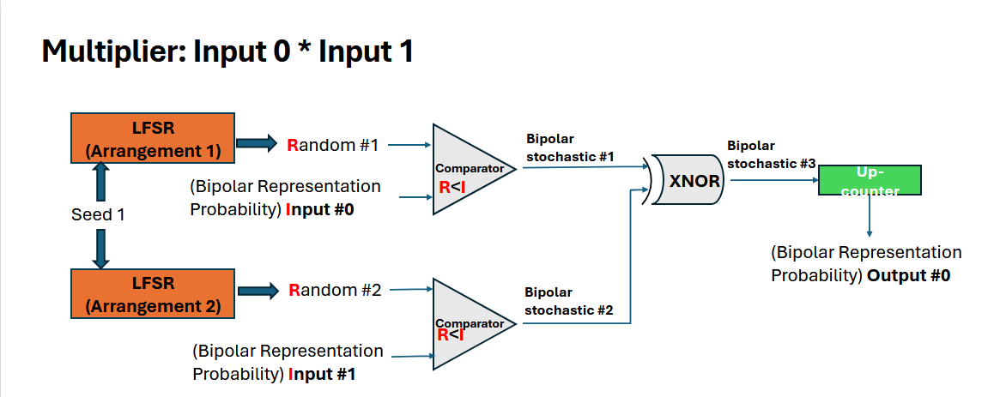
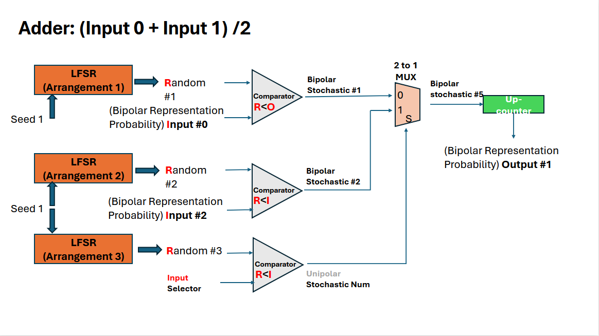
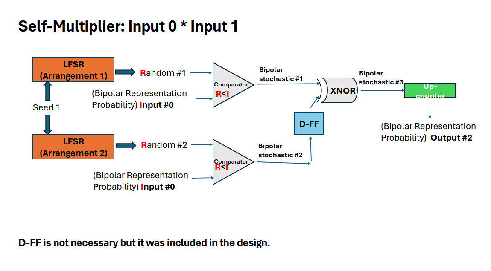

<!---

This file is used to generate your project datasheet. Please fill in the information below and delete any unused
sections.

You can also include images in this folder and reference them in the markdown. Each image must be less than
512 kb in size, and the combined size of all images must be less than 1 MB.
-->

## How it works

## References
​
General Stochastic Computing Design:​

A. Alaghi, W. Qian, and J. P. Hayes, “The Promise and Challenge of Stochastic Computing,” IEEE Trans. Comput. Aided Des. Integr. Circuits Syst., vol. 37, no. 8, pp. 1515–1531, Aug. 2018, doi: 10.1109/TCAD.2017.2778107.​

B. R. Gaines, “Stochastic computing,” in Proceedings of the April 18-20, 1967, spring joint computer conference, in AFIPS ’67 (Spring). New York, NY, USA: Association for Computing Machinery, Apr. 1967, pp. 149–156. doi: 10.1145/1465482.1465505.​

Gross, W. J., & Gaudet, V. C. (Eds.). (2019). Stochastic Computing: Techniques and Applications (1st ed. 2019.). Springer International Publishing. https://doi.org/10.1007/978-3-030-03730-7​

Qian, W. (2011). Digital yet deliberately random: Synthesizing logical computation on stochastic bit streams (Order No. 3466985). Available from ProQuest Dissertations & Theses Global: The Sciences and Engineering Collection. (885872145). Retrieved from http://search.proquest.com.libaccess.sjlibrary.org/dissertations-theses/digital-yet-deliberately-random-synthesizing/docview/885872145/se-2​

LFSR Design in Stochastic Computing:​

Jason H. Anderson, Yuko Hara-Azumi, and Shigeru Yamashita. 2016. Effect of LFSR seeding, scrambling and feedback polynomial on stochastic computing accuracy. In Proceedings of the 2016 Conference on Design, Automation & Test in Europe (DATE '16). EDA Consortium, San Jose, CA, USA, 1550–1555. https://dl.acm.org/doi/abs/10.5555/2971808.2972171​

Digital QIF neuron:​

E. J. Basham and D. W. Parent, "Compact digital implementation of a quadratic integrate-and-fire neuron," 2012 Annual International Conference of the IEEE Engineering in Medicine and Biology Society, San Diego, CA, USA, 2012, pp. 3543-3548, doi: 10.1109/EMBC.2012.6346731

## How to test
Input 2 repeating streams of 9 bits (+1 bit buffer) that represent the numbers to be multiplied/added.
The self multiplier only processes input from the 1st stream.
Read the serial output result, which is also 9bits (+1 bit buffer).

## External hardware
ADALM2000
