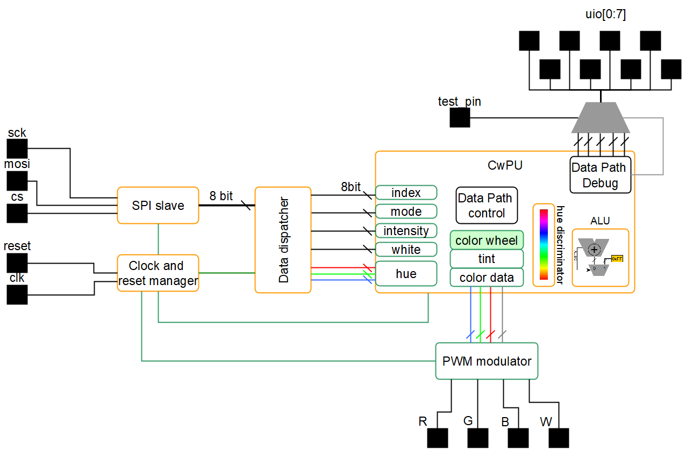
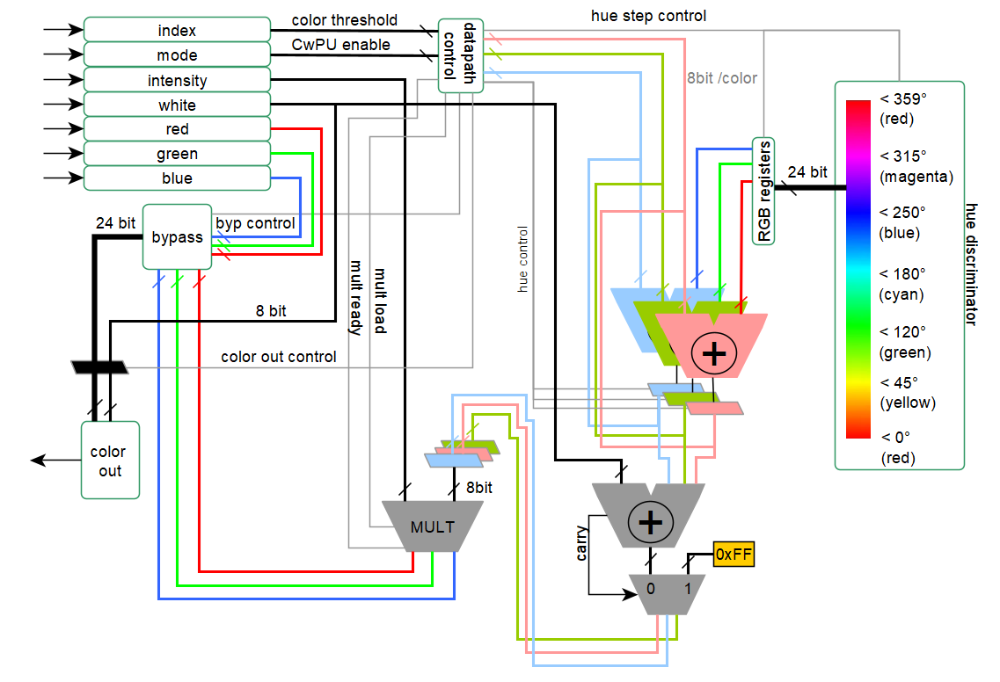
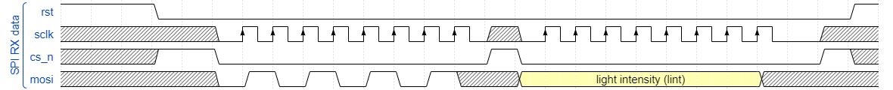
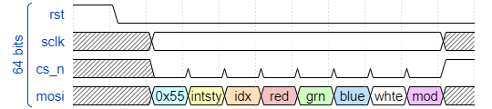

<!---

This file is used to generate your project datasheet. Please fill in the information below and delete any unused
sections.

You can also include images in this folder and reference them in the markdown. Each image must be less than
512 kb in size, and the combined size of all images must be less than 1 MB.
-->

## How it works
Color generator for RGBW LEDs, with generation of hue, tint and intensity based on a color index. Is also a direct SPI to 4 PWM channels converter, making it flexible to any different kind of use. The system block diagram is as follow:

It is an SPI slave in Mode 0, with SPI protocol consisting of 8 byte long command, discriminated with a preamble sequence (see Protocol and Test for the description).

This payload is unpacked in different data: red, green, blue, white, bypass mode, intensity, color index. This data is then provided to the color wheel processor. If the bypass mode is activated, the RGBW info from the red, green, blue and white SPI bytes is directly provided as a PWM output in the respective channels.

If bypass mode is not active, only the white, intensity and color index are considered, from which the hue (RGB data) is generated based on the index, then a tint (hue + white) and then the intensity is applied, forming the final color. This is then applied to the PWM outpus to the respective channels. 

When bypass mode is not active (color wheel mode), then there is a latency proportional to the "rotation" of the color wheel, i.e. lower the number lower the latency. This is the laterncy of the color wheel processing unit (CwPU), after which the desired complete color is output on the PWM channels.

### Debug pins

A debug enable pin, when asserted, will output on the uio pins different internal signals of the CwPU while in operation. This is just to check the internal signals in case the tapeout goes wrong, and for curiosity purposes for fidelity against the gate level simulation.

### PWM modulator

The PWM modulator has a period of t_pwm = t_clk_presc * 256, and a resolution of 1/256 steps. The t_clk_presc is the prescaled clock, t_clk_presc = t_clk * 2.
Each update is synchronous to the period, hence any change in the duty cycle will happens to the next PWM period without generating artifacts.

### Clock and reset maanger

The clock and reset manager will issue a precaled clock to the whole system by a factor of 2, except for the multiplicator, which has to run twice as fast w.r.t. the system. A toggle on the reset pin will reset the whole system at the next reset _release_. Meaning, to reset the system, the reset (active low) must go to LOW, then it must be deasserted to HIGH. By doing this, the clock must be always present (sync reset). 

When reset is deasserted (HIGH), the manager will start and will keep the rest of the system in reset state for the next 128 t_clk cycles (main clock from the pin). This will guarantee that the whole system will be correctly initialized.

Therefore any SPI transaction can take place after at least 128 clock cycles after reset condition is deasserted, otherwise one SPI packed would be lost.

### Color wheel processor

The logic datapath of the CwPU is shown below:

The CwPU has all the data width of 8 bit, and the energy intensive color discrimination path is active when non in bypass mode only. When active will take the index. Starting from zero, increments the hue progression and compares against this index (i.e. rotates the color wheel) to process at run time with no LUT, the corresponding requested hue. During the rotation, the RGB internal values will also change, increasing and decreasing the hue components to sweep all the combinations to match the requested one. The final value will be used for the next step, which is the tint.

The next step is the sum of the white component, generating a tint, a white adjusted color. It will sum the white up to the maximum value, and the value is output to the intensity multiplier. Also the white is output to the multiplier. This is to not only output an RGB to emualate the white, but to increase the color rendering index (CRI) by allowing to use a single output that can be connected to a pure white generator/phosphor based white LED.

The multiplication for the intensity then takes place with a single multiplicator unit, hence the local control takes care of the data load and synchonization, with 2 clock cycles per operation. Since the multiplicator goes twice as fast, the CwPU has not additional wait states, resulting in 1 CwPU clock cycle delay. Also the white is multiplied. After this step, the output data of each component (R, G, B and W) are 16bit, but the 8 LSB are truncated, generating a final 24 bit color information and 8 bit white.

This data is used by the 4 channel PWM modulator.

When in bypass mode, the CwPU will only replicate the same RGBW info in input to the PWM modulator input in one clock cycle.

### SPI protocol

SPI is Mode 0 as shown in this timing diagram, highlighting the preable and first byte transfer:

While a whole packet must be compliant with the following diagram:

Which contains: 

1. preamble: 0x55
2. intensity: 0x00 - 0xFF
3. color index: 0x00 - 0xFF
4. red: 0x00 - 0xFF
5. green: 0x00 - 0xFF
6. blue: 0x00 - 0xFF
7. white: 0x00 - 0xFF
8. bypass mode: 0xA4 for the color generation, 0x21 bypass

Note that in between each byte is mandatory to toggle the CS signal, since in reality a full transaction is interpreted as a 8 individual single byte transactions.
Therefore, if the bus gets corrupted, sending any data without preamble with more than 8 bytes, will ensure a clean bus state ready to be synchronized again. Otherwise a reset is an alternative.

## How to test

This is normally tested with a micropython script to be interpreted directly from the REPL interface of the TT08 demoboard (see https://tinytapeout.com/guides/get-started-demoboard/).
To test the design simply setup the demoboard, and run the script in [the test folder](../test/rp2040_demoboard). It means it can be simply copy/pasted into the REPL terminal.

To see an output, is suggested to wire some LEDs to the output of the demoboard being careful to not overload the output pins. If you don't know what you are doing, then is better to get like 4x of these for the 4 LEDs [tindie.com/products/aleadesigns](https://www.tindie.com/products/aleadesigns/glighter-a-40w-hysteretic-led-driver) or any other LED controller that **won't load** more than 4mA on the TT08 chip output pads (see [pad spec here](https://tinytapeout.com/specs/gpio/)).

*A custom PMOD will come soon to ease the LED test.*

With the RP2040 no input wiring is needed, and the output will be:

uo_out[0] -> Red LED

uo_out[1] -> Green LED

uo_out[2] -> BLue LED

uo_out[3] -> White LED

# What to expect on the outputs

Given the HUE ternary (r,g,b) processed from the index by the CwPU, the final color is
*RGBW = ((r,g,b)+w)intensity*, having a PWM signal per each color channel.

So the white and intensity have a direct impact regardless the hue generated.

The output "color equation" with bypass is
*RGBW = spi(red, green, blue, white)* with NO intensity, NO automatic white.
In this mode, the data provided via SPI is the data taken by the PWM modulator as is.

   
## External hardware

While we're working at a PMOD right now, the external hardware are 4 LEDs, one per each color, connected to the outputs. Be aware that the outputs cannot take more than 4mA!!! So a dedicated circuit is needed (but will be provided soon). Stay tuned.

To control the design, no external controller is needed since it uses the internal RP2040 of the demoboard, see the [documentation here](../test/README.md) of the test and the REPL [script here](../test/rp2040_demoboard/bringup_test_pico.py).
Alternatively, a custom firmware and another dedicated python script is provided with the relative [STM32 based project](../test/stm32), briefly [documented here](../test/README.md).
