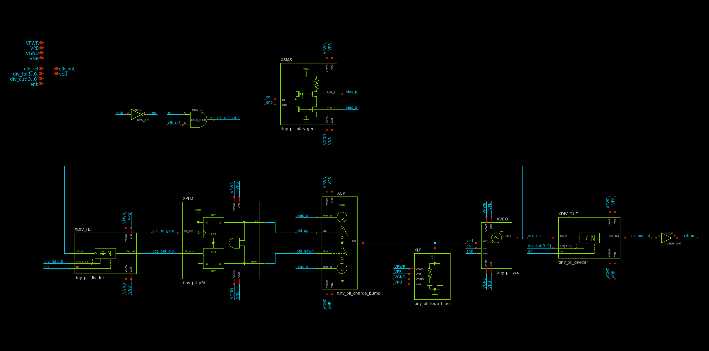
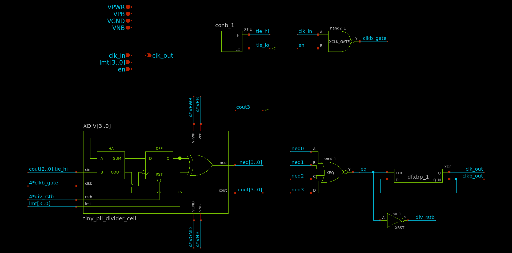
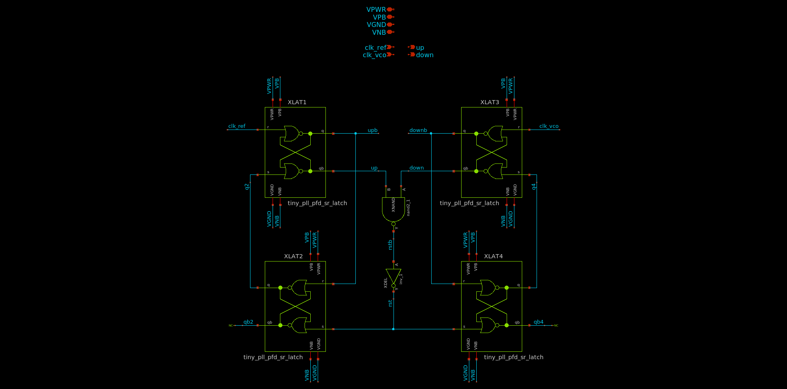
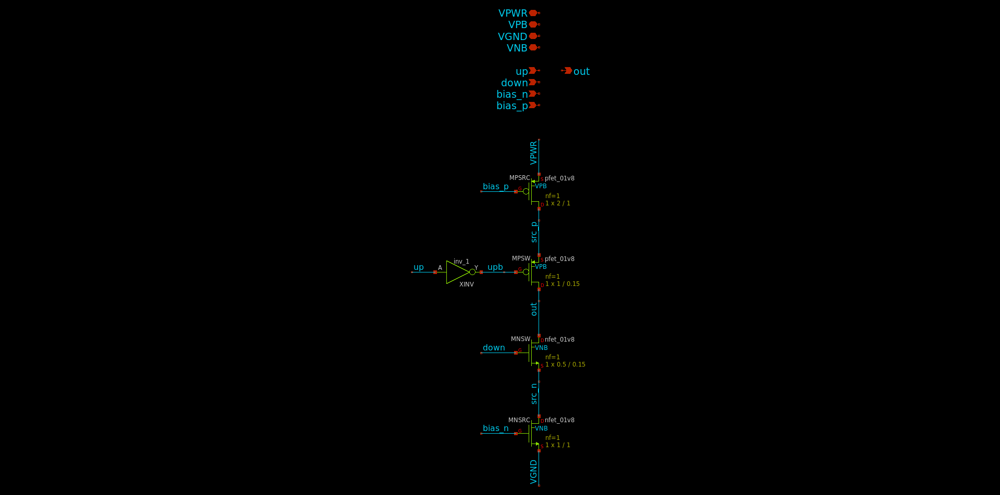
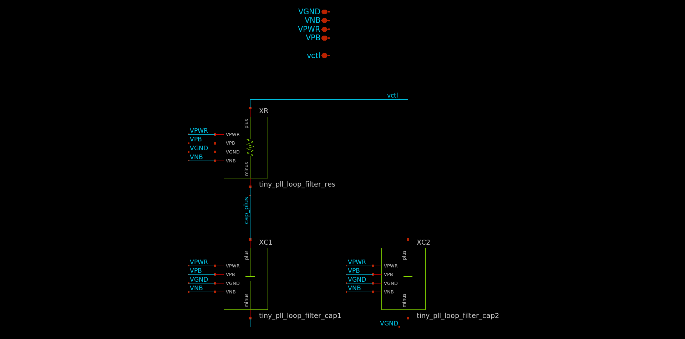
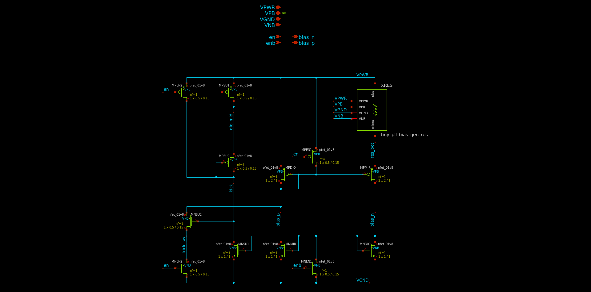

# How it works

## Overview

This project showcases `tiny_pll`, a completely self-contained fractional-N
frequency synthesizer using less than 6% of the area of a 1x1 TinyTapeout tile.
The design goals of this project were as follows:
1. The design should be as simple as possible to reduce the chance of failure.
2. The design should be as small as possible so it can be incorporated into
future Tiny Tapeout designs with minimal area overhead.

There are 4 `tiny_pll` instances in this project. Each instance multiplies the
frequency of a reference clock by a rational number A/B, where A and B can be
between 1 and 15. Such a block has two main use cases:
1. Generating several internal clocks from a single off-chip oscillator (e.g.,
for a large digital design with multiple clock domains)
2. Generating one or more internal clocks at a higher frequency than what can be
provided to the tile through the mux and GPIO pins

`tiny_pll` is designed for a 10 MHz reference input, which implies an output
frequency between 67 kHz and 150 MHz. The 4 output clocks are connected to the
GPIO pins `uo[3:0]`. In reality, the maximum output frequency is limited by 4
factors:
1. The speed of the Caravel I/O cells, which itself is a factor of the off-chip
load capacitance
2. The routing between the TT mux and the I/O cells
3. The speed of the TT mux
4. The routing between the project tile and the TT mux
The minimum output frequency is limited to roughly 1 MHz due to the minimum
speed of the VCO.

A 1-bit delta-sigma ADC is included to allow measurement of the analog control
voltage on `uo[4]`.

This design is inherently mixed-signal due to the analog nature of the PLL.
Consequently, the top-level layout is implemented as a custom analog/digital
section for the PLL and ADC, surrounded by RTL which implements the
control/status registers (CSRs) and various clock buffering and multiplexing
functions. Schematics were created using `xschem` and simulated with `ngspice`;
custom layout was done using `klayout` with the Efabless `sky130` PDK; digital
synthesis and PnR was done using a custom OpenROAD flow; and `magic` and
`netgen` were used for LVS, DRC and parasitic extraction.

## PLL

The top-level schematic of `tiny_pll` is shown below:

The PLL uses a standard fractional-N architecture, where an input and output
frequency divider are used to set the frequency multiplication with respect to
the reference clock input. The output frequency is `A/B * f_ref`, where `A` is
the division ratio of `XDIV_FB`, `B` is the division ratio of `XDIV_OUT` and
`f_ref` is the input clock frequency. Documentation for the PLL subcells is
included below.

Throughout the schematics, the pins `VPB` and `VNB` are included to connect the
bulk terminals of all PMOS and NMOS devices, respectively. This is done to
ensure the corresponding terminals of the standard cell instances at each level
of hierarchy are propagated to the top level and connected to VPWR and VGND.

### Divider

Frequency dividers are implemented using a 4-bit binary counter followed by 4
XOR gates to check for equality with a division ratio input `lmt[3..0]`. When
the counter output is equal to `lmt`, `div_rstb` is immediately asserted, which
resets the counter to 0 at the rising edge of `clk_in`. As a result, the maximum
division ratio from `clk_in` to `eq` is 15, when `lmt == 4'b1111`.

Since the counter is reset as soon as its output is equal to the division ratio,
a very short pulse is produced at the `eq` node, with a duration equal to the
propagation delay of the counter. This could potentially be a timing concern for
`XDF`, but since the counter delay is at least 3 gate delays, the flip-flop was
observed to operate as intended across process, voltage and temperature (PVT) in
simulation.

The D flip-flop (DFF) at the output is included to ensure an output duty cycle
close to 50%. As a result, the actual output frequency is `f_ref / (2*lmt)`,
which implies a division ratio from `clk_in` to `clk_out` between 2 and 30.

The tie cell `sky130_fd_sc_hd__conb_1` is used when gates must be connected to
VPWR or VGND to avoid potential ESD issues.

### Phase-frequency detector (PFD)

The PFD is composed of two DFFs, clocked by the divided VCO output and the
reference input, respectively. Since the input of both DFFs is tied to 1, each
DFF can be implemented using two S-R latches, each of which uses two `nor2`
gates. The full PFD thus uses 8 `nor2` gates, one `nand2` and one `inv_1`, which
is considerably smaller than using discrete DFF standard cells with the D inputs
tied to VPWR.

A NAND followed by an inverter is used instead of a single AND to slightly
increase the minimum output pulse width and avoid charge pump glitches.

### Charge pump

The charge pump uses two current sources (`MNSRC` and `MPSRC`), which can be
interchangeably switched to the output with the `up` and `down` inputs. The
charge pump current is nominally 1 uA and is set by the bias generator. The
switches use nearly minimum width to reduce area, and minimum length to reduce
capacitance. The PMOS switch uses 2x the W/L of the NMOS switch to ensure
roughly equal drain-source saturation voltages (VDSAT).

### Loop filter

The loop filter is implemented using a series R/C combination to compensate the
loop transfer function such that a zero is placed below the crossover frequency
to ensure stability, and a pole is placed above the crossover frequency to
ensure fast settling time. A second capacitor `XC2` is included to reduce ripple
in the control voltage, which in turn reduces phase noise at the PLL output.
Component values were selected using a linearized model developed using
schematic-only simulations of the VCO to determine the voltage-to-frequency
gain. The loop bandwidth was chosen to be on the order of 100 kHz, with a phase
margin of 65 degrees at an output frequency of 10 MHz. The resulting R/C values
are `R = 100 kOhm` and `C1 = 1 pF`.

In reality, the loop characteristics vary significantly across output frequency
due to the nonlinear gain of the VCO, which was observed to have a nearly
exponential voltage-to-frequency characteristic in simulation. This is likely
due to the VCO current sources operating in the subthreshold region, where the
ID/VGS characteristic is near-exponential.

The loop filter resistor is implemented using the `urpm` high-resistance poly
implant, which is roughly 2 kOhm/square. While e-test values are not provided
for this resistor in `sky130`, the value is not critical, and significant
variations (+/-50%) were observed to result in a stable loop in simulation.

The loop filter capacitors are implemented using NMOS devices with drain and
source shorted to VGND. This is due to the significantly higher capacitance
density of MOS devices relative to MIM capacitors (~8 vs ~2 fF/um^2). The MOS
capacitance is highly nonlinear and increases at high control voltages due to
the inversion charge, but again the capacitor value is not critical and this
nonlinearity does not cause instability in the feedback loop.

The loop filter consumes nearly 50% of the area of the PLL. Various methods were
explored to reduce loop filter area, including:
1. MIM capacitors could be used and placed on top of the other circuit blocks to
reduce area
2. A capacitance multiplier could be used to allow a smaller intrinsic
capacitance

The MIM capacitor method is possible, but there is some ambiguity in the
`sky130` design rules as to whether a MIM capacitor can be placed over `met1`
and the base layers (see `capm.10` in the [sky130 periphery
rules](https://skywater-pdk.readthedocs.io/en/main/rules/periphery.html#capm).
Additionally, this could result in unwanted noise from the digital blocks
coupling into the capacitors, which could degrade phase noise performance.
Further, the capacitors would have to be divided up to lie between the power
rails on `met4` which would increase their area.

A capacitance multiplier was implemented using a 100 fF capacitor with a 10:1
multiplication ratio, but the final layout was the same size as the MOS
capacitor implementation and was thus exlcuded from the final design. The
capacitance multiplier was additionally seen to have poor high-frequency
response compared to a MOS or MIM capacitor, which resulted in unacceptably high
control voltage ripple.

### Voltage-controlled oscillator (VCO)

The VCO is a 3-stage current-starved ring oscillator using standard cell
inverters. The current sources are minimum-length to maximize W/L, which in turn
minimizes VDSAT, and minimize capacitance. The output resistance of these
current sources is irrelevant since it only matters that the oscillator current
is limited, and not the particular limit value. A triode device `MNCTL` is used
to control the source/sink current of the VCO. LVT NMOS devices are used to
ensure the operating control voltage is somewhere near half supply at an output
frequency of 10 MHz, which helps ensure the maximum output frequency can be met
across process variations. Four "keeper" devices (`MNEN1`, `MNEN2`, `MNEN3` and
`MPEN`) are included to disable the circuit with zero static power consumption.

### Bias generator

The bias generator is a self-biased current mirror, which provides a roughly
supply-independent current for the charge pump. The exact current is highly
dependent on the poly resistor `XRES`, but is designed to be nominally 1 uA at
25 degrees C. A startup circuit is included to ensure the bias generator does
not fall into an undesirable operating point where `IOUT = 0`. The diode devices
`MPSU1` and `MPSU2` charge the `kick` node to VPWR when the circuit is enabled,
which pulls `bias_p` low and establishes a current in the mirror devices. Once
the mirror is active, `MNSU1` pulls `kick` low and disables the startup circuit.
Multiple "keeper" devices are included to disable the circuit with zero static
power consumption.

