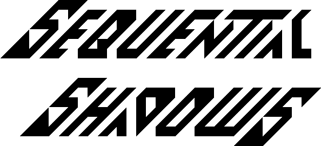

<!---

This file is used to generate your project datasheet. Please fill in the information below and delete any unused
sections.

You can also include images in this folder and reference them in the markdown. Each image must be less than
512 kb in size, and the combined size of all images must be less than 1 MB.
-->

## Intro

Curly / Medieval presents

my contribution to the Tiny Tapeout 8 demo competition.
Code, graphics, and music by Curly (Toivo Henningsson) of Medieval.

This is the deluxe version, with Pmod VGA RGB444 output support and a few changes from the original, in 2x2 tiles compared to the original's 1x2.

The demo can be seen at https://youtu.be/pkiTu3iLA_U (captured from a Verilator simulation).

## How it works

See the documentation for the original version: https://github.com/toivoh/tt08-demo/blob/main/docs/info.md / Tiny Tapeout 8 project [770].
The deluxe version adds some tweaks such as a shadow beneath the logo, and credits.

## How to test

Plug in a [TinyVGA](https://github.com/mole99/tiny-vga) compatible Pmod on the TT08 demo board's out Pmod.
Plug in a Pmod compatible with [Mike's audio Pmod](https://github.com/MichaelBell/tt-audio-pmod) on the TT08 demo board's bidir Pmod.
Set all inputs to zero to get the default behavior.
**Warning: The default behavior includes some flashing ligts.** Set `v_bass_off` and `v_drums_off` (keep `ui_in` at 3 instead of 0) to remove flashing.
The demo starts directly after reset.

This demo is best viewed with the monitor rotated 90 degrees, with the left side facing down.

### Inputs
There is no guarantee that changing the inputs after reset is released works as intended, but it probably does.
Some of the inputs provide options on how the demo is run:

- `v_bass_off`: Setting this high reduces flashing when the audio visualizer is on by turning off the bass.
- `v_drums_off`: Setting this high reduces flashing when the audio visualizer is on by turning off the drums.
- `v_bass_low`: Setting this high keeps the bass at its default octave even when the audio visualizer is on, which increases flashing.
- `pause`: While this is high, the demo is paused and the sound is turned off. Can probably be used to start the demo paused.
- `step_frame`: While this is high, the the demo advances one frame per cycle. Used for testing.
- `rgb444_mode`: Setting this high sets the output to RGB444 mode instead of the default RGB222
- `pmod_vga_pinout`: Setting this high enables the alternative Pmod VGA pinout.
	- The `t_` outputs are used when `pmod_vga_pinout` is low. This fits the TinyVGA Pmod pinout. (`p_` only outputs are not driven.)
	- The `p_` outputs are used when `pmod_vga_pinout` is high. This fits the Pmod VGA pinout.
- `logo_shadow_off`: When high, removes the logo's shadow (like in the non-deluxe version).

If using A Pmod VGA as output, you can set `rgb444_mode` to increase the color depth, or leave it unset to get the original RGB222 experience. Please try both: which to prefer is a matter of taste.

For the demo competition, only use a Pmod VGA if you have one and can get sound output while using it.
If using Pmod VGA, set `pmod_vga_pinout`, and you can set `rgb444_mode` as well. Don't set any other inputs.
If using TinyVGA for output, set all inputs to zero.

## External hardware

This project needs
- either
	- a [TinyVGA](https://github.com/mole99/tiny-vga) VGA Pmod.
	- [Mike's audio Pmod](https://github.com/MichaelBell/tt-audio-pmod).
- or a [Pmod VGA](https://digilent.com/reference/pmod/pmodvga/start)
	- There is no ready option to output the audio in this case, but it's still present on the same pins, so you may be able to get it out with some creative wiring, and e g feed it to [Mike's audio Pmod](https://github.com/MichaelBell/tt-audio-pmod).

The choice of pinout is controlled by the `pmod_vga_pinout` input.
