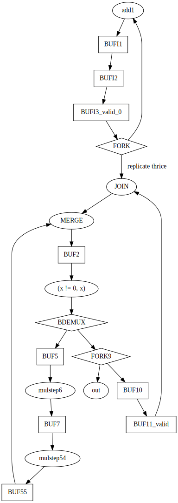

<!---

This file is used to generate your project datasheet. Please fill in the information below and delete any unused
sections.

You can also include images in this folder and reference them in the markdown. Each image must be less than
512 kb in size, and the combined size of all images must be less than 1 MB.
-->

## How it works

This design emits a sequence of `r` = x^2+x, for x=0,1,2,... on the
outputs using the handshake protocol (tie ack to req to get free
running sequence).  Well, in truth, we use 26-bits of internal
precision, but we only have 15-bits for outputs, we what is actually
emitted is `r ^ (r >> 15)`.

The very naive algorithm (with the body unrolled once) is

``` python
x = 0
loop:
  x = x + 1
  a = b = c = x
  while b != 0:
    if (b & 1) == 1:
      c += a
    a *= 2
    b /= 2
    if (b & 1) == 1:
      c += a
    a *= 2
    b /= 2
  output (c)
```

which was hand translated (roughly following [Introduction to
Asynchronous Circuit
Design](https://orbit.dtu.dk/files/215895041/JSPA_async_book_2020_PDF.pdf)
) into a token flow graph:



Note, I use a simpler, less expensive, construction for the
conditional iteration as having independent control-flow for the
trivial condition is overkill.

The graph was realized using four-phase bundled data.  Alas, I'm still
working on the timing analysis, so the inserted delays are (hopefully)
way oversized.

## How to test

The data is presented using the standard 4-phase (RTZ) protocol (idle,
Req, Req+Ack, Ack, idle, ...).  To get a continuous stream, simply tie
ack to req.  The values expected are 0, 2, 6, ..., x(x+1)

## External hardware

A logic analyzer is convenient to pick up the values on the outputs, but
default RP2040 works fine.
