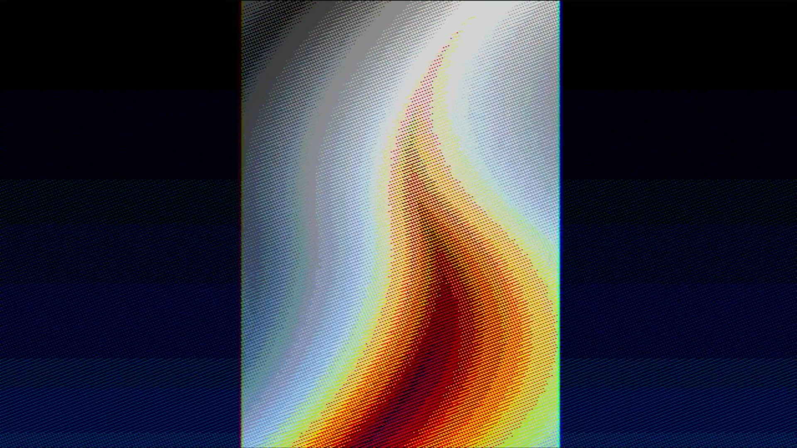

<!---

This file is used to generate your project datasheet. Please fill in the information below and delete any unused
sections.

You can also include images in this folder and reference them in the markdown. Each image must be less than
512 kb in size, and the combined size of all images must be less than 1 MB.
-->

# Flame - Konrad & Linus tinytapeout08 demo compo entry

## How it works

It shows a flame and plays audio. The VGA output is standard 640x480@60Hz, audio is simple 1 bit PWM.

## How to test

Run clock at 25MHz, connect VGA and sound Pmods, and give it a reset pulse.

## External hardware

Follows the [democompo hardware rules](https://tinytapeout.com/competitions/demoscene/#what-are-the-rules):

[TinyVGA Pmod](https://github.com/mole99/tiny-vga) for video on o[7:0].

1-bit sound on io[7], compatible with [Tiny Tapeout Audio
Pmod](https://github.com/MichaelBell/tt-audio-pmod), or any basic ~20kHz RC filter
on io7 to an amplifier will work.
