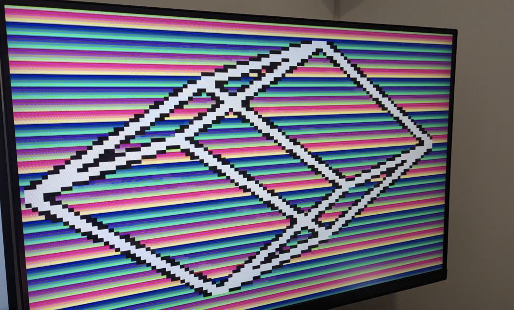
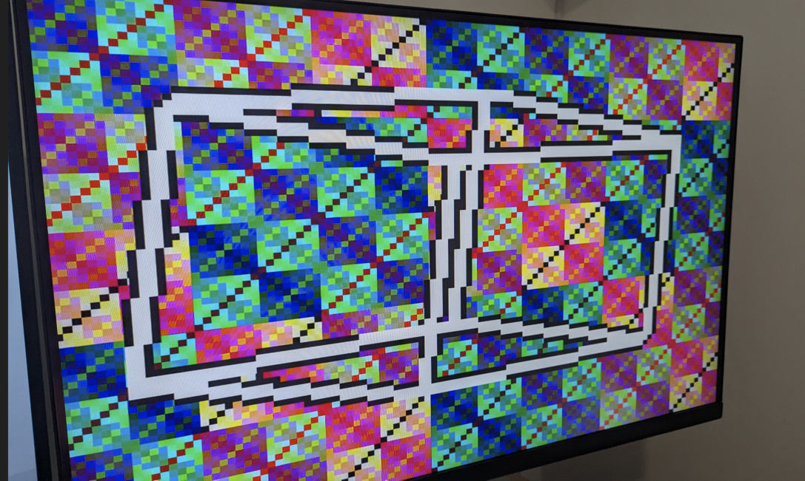
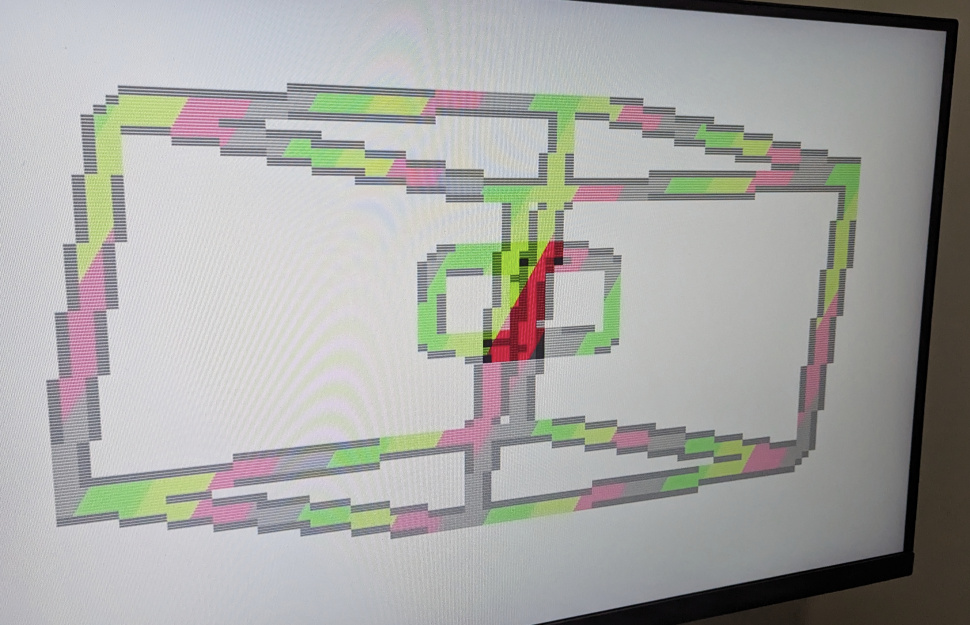
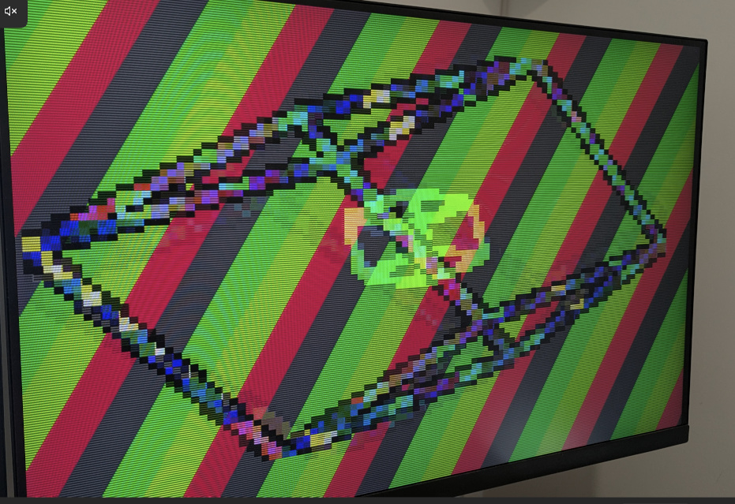

<!---

This file is used to generate your project datasheet. Please fill in the information below and delete any unused
sections.

You can also include images in this folder and reference them in the markdown. Each image must be less than
512 kb in size, and the combined size of all images must be less than 1 MB.
-->

## How it works

The central point of this demo revolves around an optimized implementation of a technique known as the edge function. The edge function is used to determine if a point lies to the left or right of a line. Typically, a pixel is tested against all three sides of a triangle to decide whether it lies inside the triangle and should be coloured accordingly.

In this demo, however, I'm using the magnitude of the edge function to decide whether a pixel should be colored as part of a line: If the magnitude is smaller than a certain threshold, then the pixel is considered to be part of the line. This can be used to render wireframe geometry. By changing the threshold, the thickness of the wires can be adjusted.

The demo renders a three-dimensional rotating wireframe cube.
The points of the cube are not generated on the fly, instead, they are stored in a ROM. By ordering the points so that the first point is always to the left and below the second point the implementation of the edge function can be optimized further. The coordinates are scaled by half to create the points for a second, smaller, rotating cube. Alternating between these two cubes every other frame creates the illusion that they exist at the same time.

## How to test

Connect a Tiny VGA to the output Pmod port, set the clock frequency to two times 25.175 MHz = 50.350 MHz, make sure `ui_in` is set to `0x00` and enjoy the show!

|   |   |
|---|---|
|   |   |
|   |   |

If you want to mix things up, try these settings:

- `ui_in[2:0]` is used to change the background fill color
- `ui_in[5:3]` is used to change the cube line fill color
- `ui_in[7:6]` is used to change the animation speed

## External hardware

- [Tiny VGA Pmod](https://github.com/mole99/tiny-vga)
