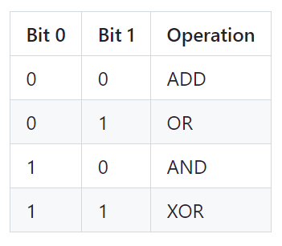
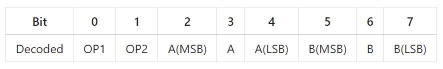

<!---

This file is used to generate your project datasheet. Please fill in the information below and delete any unused
sections.

You can also include images in this folder and reference them in the markdown. Each image must be less than
512 kb in size, and the combined size of all images must be less than 1 MB.
-->

## How it works

This design executes binary operations on two octal numbers encoded in an 8-bit instruction and outputs the result to the 7-segment display.
The instruction is made up of 8 total bits.  

Bits 0 and 1 make up the operation code. Operations are according to the following table.

Bits 2, 3, and 4 make up operand A. Bit 2 is MSB and bit 4 is LSB.

Bits 5, 6, and 7 make up operand B. Bit 5 is MSB and bit 7 is LSB.

A full operation would be decoded like this

## How to test

1. Craft a instruction following the above decoding table. 
2. Enter the instruction on the TT08 PCB's input pin dip switches.
3. View the result on the 7 segment display

   Note: An overflow condition during an add operation will illumniate the 7 segment display's DP.

Examples:

1. 0 0 1 0 0 0 0 1 -> ADD 4, 1 -> Displays 5 on 7-Segment Display
   
2. 1 1 1 0 0 1 0 1 -> XOR 4, 5 -> Displays 1 on 7-Segment Display
   
3. 1 0 1 0 0 1 0 1 -> AND 4, 5 -> Displays 4 on 7-Segment Display

4. 0 1 1 1 0 1 0 1 -> OR  6, 5 -> Displays 7 on 7-Segment Display

5. 0 0 1 0 1 1 1 0 -> ADD 5, 6 -> 7-Segment Display DP illuminated indicating overflow condition

## External hardware

The only external hardware required is the 7 segment display provided by the tt08 PCB.
