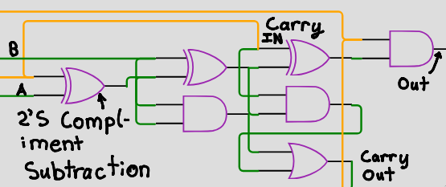
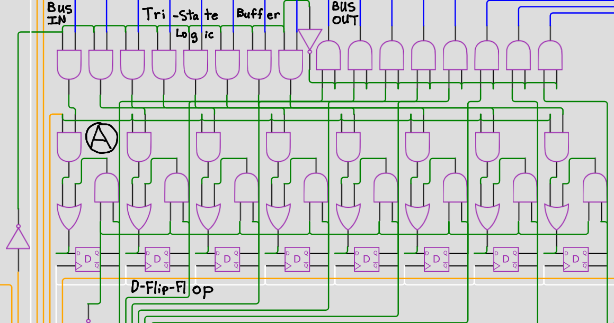
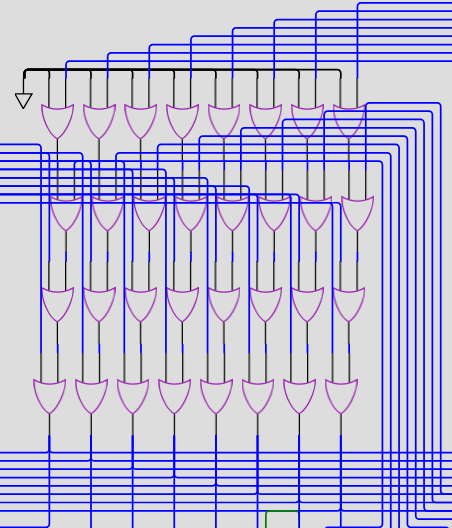

<!---

This file is used to generate your project datasheet. Please fill in the information below and delete any unused
sections.

You can also include images in this folder and reference them in the markdown. Each image must be less than
512 kb in size, and the combined size of all images must be less than 1 MB.
-->

## How it works

The project currently works by including a 8-bit shift register connected to the bus. The SI pin can be used to shift data into the register, and the ESO pin determines whether the shift-register will output to the bus. The bus is a conjunction of OR-gates making it one directional (as simply combining the wires seems less possible). There is a tri-state buffer that connects to two registers (register A and B) allowing them to interact with the bus. The direction is controlled using DIRA and DIRB. If the DIRA/DIRB sets the direction to be using the bus as an input, LA/LB determines whether the register should load what is on the bus. Register B is connected to the ALU and may be inverted to form a 2's Compliment substraction using the AS pin. The ALU will thus perform addition or subtraction depending on the state of AS. It will take Register A as the other input and output to the bus if the EAO pin is pulled high.

You can see here an annotated diagram of a single portion of the ALU. The wires labeled A and B represent the arbitrarily named inputs (in this case, the input labeled A actually comes from the B register and vice versa). The original xor gate allows for 2's compliment subtraction with input A. The orange wire labeled carry in comes from the AS pin and determines whether A is being added or subtracted. 2's compliment subtraction requires one be added to the number so we carry one in (this is the LSB, so nothing would be carried in typically). The output on the right is the single digit output. The carry out will be hooked up to the carry in of the next segment to add numbers greater than 1 bit.

You should be able to see here an annotated diagram of a single register. The 8 blue wires to the right of "Bus IN" represent the bus input and will only be active if the DIRA pin is set low (because of the invertor towards the bottom left). This is inverted to determine whether the bus should be considered an output and the bus output appears on the top right. The section labeled "A" is a special circuit that does not load any data if the LA pin is not high. Because the D-Flip-Flop circuit will complain if its clock input contains any logic when being converted, a more difficult method to prevent unintended data modification must be used. If the LA pin is not high, the Q pin is piped back to the D pin on each of the flip-flops, retaining the data.

This picture demonstrates the data bus. It uses logical OR gates to connect a series of wires together which are then used to produce output. The bus output is shown as the output of the entire circuit, and can be used to send data between the ALU and registers.

## How to test

Input your two numbers MSB first (using the SI pin), pulsing the clock after inputting each individual bit. Set the ESO pin high to output the contents of the shift-register to the bus. Leave DIRA and DIRB on their default to allow information to stream in from the bus (inverting them will output the contents of register A or B to the bus). Set LA or LB appropriately depending on where you would like to load information. Pulse the clock to load information from the bus to any listening registers. Reset LA/LB to prevent accidentally overwriting data from the bus. Whenever Register A and B are set correctly, set the AS pin depending on whether you desire to add or subtract register B. Set the EAO pin high to output the contents of the ALU to the bus. The output pins will mirror the bus and be produced with OUT0 indicating the LSB and OUT7 indicating the MSB.

You will likely wish to shift a few zeros into the shift-register first to ensure it is not full of corrupted data (it likely will be when the chip is initially started).

One fun thing to do is load the value 1 into register A and 0 into register B then set the contents of the ALU to output to the bus and set LB high. This will cause 1 to be added to register B every clock pulse and you should be able to see the output count up. You can do the same thing but backwards if you set the AS pin high.

| Pin Location | Pin Name | Expanded Name        | Description                                                |
|--------------|----------|----------------------|------------------------------------------------------------|
| 0            | SI       | Serial Input         | user may input data serially using this pin                |
| 1            | ESO      | Enable Serial Output | outputs the shift-register to the bus if high              |
| 2            | DIRA     | A Direction          | allows register A to act as an input if low and vice versa |
| 3            | DIRB     | B Direction          | allows register B to act as an input if low and vice versa |
| 4            | EAO      | Enable ALU Output    | outputs the contents of the ALU to the bus if high         |
| 5            | LA       | Load A               | loads information from the bus to register A if high       |
| 6            | LB       | Load B               | loads information from the bus to register B if high       |
| 7            | AS       | Add Subtract         | determines whether B is added (low) or subtracted (high)   |

## External hardware

A sequence of 8 LEDs is hooked up to the outputs to display the final number in binary.
